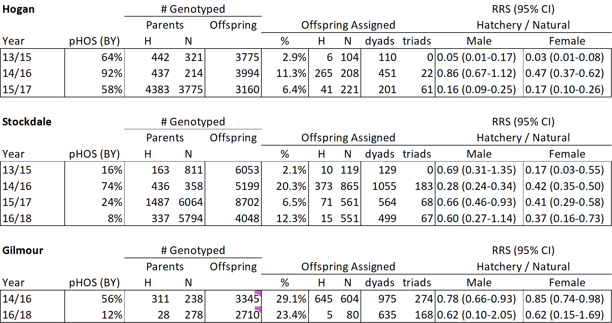
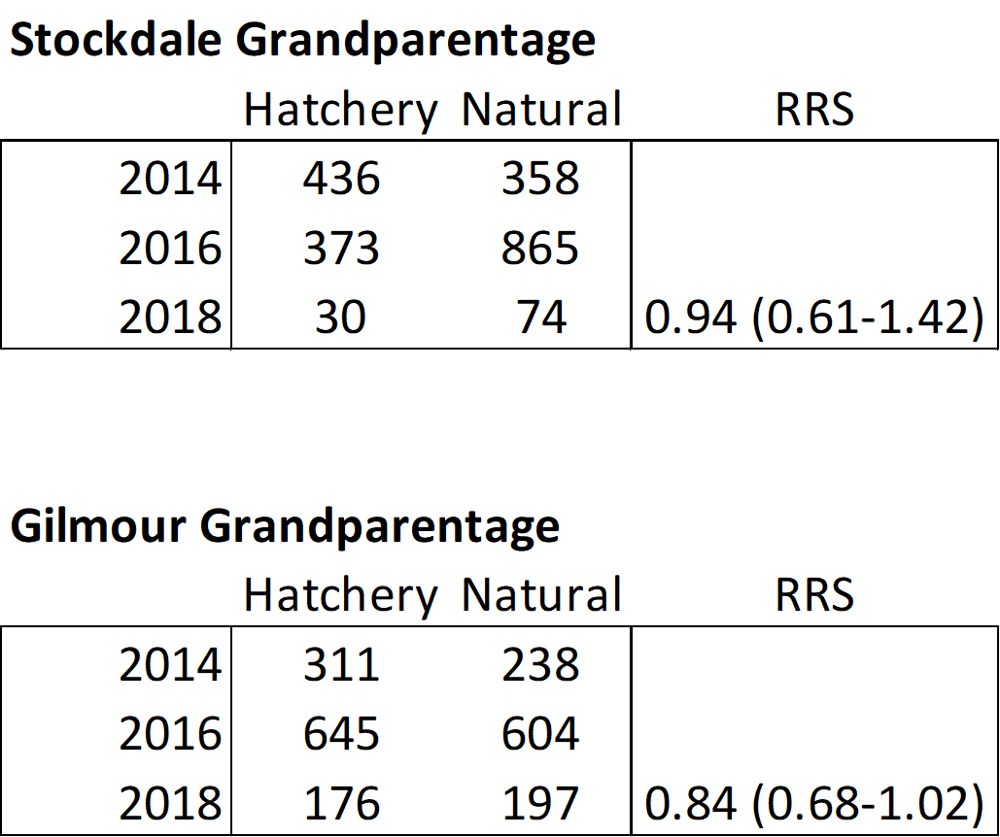

```{r setup, include=FALSE}
rm(list=ls())
#setwd("V:/Analysis/5_Coastwide/Multispecies/Alaska Hatchery Research Program/PWS Pink/GitHub-PWS-Pink-Parentage")

library(kinship2)
library(coin)
library(MASS)
library(scales)
library(tidyverse)
library(leaflet)
library(lubridate)
library(ggExtra)
#library(PBSmapping)
#library(grid)
#library(ggthemes)

knitr::opts_chunk$set(out.width = "100%", fig.width = 10)
```

# **Intro**

Below is an overview of analyses of parentage results for even lineages in Stockdale (2016-2018) and Gilmour (2014-2016-2018) Creeks alone, as well as Stockdale, Hogan, and Gilmour 2014-2016 considered together as potential parents and offspring to explore the parental contribution of natural strays. Please note that, since we do not have full otolith reads for Gilmour 2016 or 2018, these analyses include all fish sampled from Gilmour in both years. 

# **Background**
This section provides an overview of initial data manipulation and filtering.

## Quality assurance
This is a quick exploratory analysis of the genotype data. Here we:

  * Read in *LocusControl*
  * Read in all project genotypes
  * Read in paired field/otolith data from [OceanAK](http://www.oceanak.adfg.alaska.gov/)
  * Join paired data from OceanAK
  * Determine *FailureRate*
  * Perform QA on project gentoypes
    + Removing fish missing >= 20% of genotypes
    + Remove within collection duplicates
    + Explore the use of a *heterozygosity filter* to remove individuals with bogus genotype calls
    + Save final, post-QA genotypes with paired data
    * Export genotypes as a *Genepop* file to feed into *genepop2franz.GCL.r*

## *FRANz* parameters
Here, we provide a rundown of how the parentage results were generated using *FRANz* for even lineages in Stockdale (2016-2018) and Gilmour (2014-2016-2018) Creeks alone and Stockdale, Hogan, and Gilmour 2014-2016 considered together. Here, all three datasets were evaluated together as these initial steps are largely conserved and results are independent of study system. Subsequent sections include statistical analyses tailored to each study system.

**Stockdale:** *FRANz* was run Wed Oct 21 17:55 2020, with the following parameters:
FRANz.exe --Nmmax 13000 --Nfmax 13000 --femrepro 1:2 --malerepro 1:2 --typingerror 0.006 --updatefreqs --poutformat 2 "V:\Analysis\5_Coastwide\Multispecies\Alaska Hatchery Research Program\PWS Pink\Franz\stockdale_16_18_postQA_2016_2018_STOCK.dat"

**Gilmour:** *FRANz* was run Fri Oct 23 15:53 2020 for 2014-2016 and Mon Oct 26 13:45 2020 for 2016-2018, with the following parameters:
FRANz.exe --Nmmax 5000 --Nfmax 5000 --femrepro 1:2 --malerepro 1:2 --typingerror 0.006 --updatefreqs --poutformat 2 "V:\Analysis\5_Coastwide\Multispecies\Alaska Hatchery Research Program\PWS Pink\Franz\Gilmour_2016_2018\Gilmour_16_18_postQA_2016_2018_GILMOUR.dat"

**Stockdale-Hogan-Gilmour:** *FRANz* was run at Fri Oct 23 16:29 2020, with the following parameters:
FRANz.exe --Nmmax 31000 --Nfmax 31000 --femrepro 1:2 --malerepro 1:2 --typingerror 0.006 --updatefreqs --poutformat 2  "V:\Analysis\5_Coastwide\Multispecies\Alaska Hatchery Research Program\PWS Pink\Franz\2014_2016_stockdale_hogan_gilmour\stockdale_hogan_gilmour_postQA_2014_2016.dat"

**Definitions:** The parameters are defined as follows:

--Nmmax and --Nfmax are the maximum numbers of candidate mothers and fathers. To obtain our values, we used an estimated escapements of: 26,000 divided by 2 (note: based on stream walk was 26,206; no aerial survey for 2016) for Stockdale and 10,000 divided by 2 (note: based on stream walk was 4,274; no aerial surveys for 2014 or 2016) for Gilmour. These estimates are listed under 'pop est walk' in the Excel file found here: "V:\Documents\5_Coastwide\Multispecies\AHRP\Field data\Sample Summary Extract and Genotype.xlsx". For Hogan/Stockdale/Gilmour, the values used for all streams were added together.

--femrepro and --malerepro specify the age range in which an individual can reproduce

--typingerror refers to the overall genotyping error rate. Ours was 0.005 to 0.006, based on QC

--updatefreqs specifies that *FRANz* should update allele frequencies using MCMC sampling  

--poutformat specifies that all potential parents should be listed, not just the most likely 

--fullsibtest tests for full siblings among offspring. This option is in beta only and quickly maxes out memory

**Output:** All output files can be found in logically-named subfolders here: "v:\Analysis\5_Coastwide\Multispecies\Alaska Hatchery Research Program\PWS Pink\Franz"

**Power:** The summary file provides information about the power of our marker suite.   
Cumulative exclusion probability when 1 to 7 fullsibs are genotyped:  
1st Parent : 1.0000000  1.0000000  1.0000000  1.0000000  1.0000000  1.0000000  1.0000000   
2nd Parent : 1.0000000  1.0000000  1.0000000  1.0000000  1.0000000  1.0000000  1.0000000   
Parent Pair: 1.0000000  1.0000000  1.0000000  1.0000000  1.0000000  1.0000000  1.0000000
  
According to the *FRANz* manual, marker sets are not considered powerful if these cumulative exclusion probabilities are less than 0.95, indicating the probability a random pair of individuals in the population has a 5% chance of having a genotype pair compatible to an offspring genotype. Since the vast majority of our probabilities are 1, we can be confident in the power of our 298 amplicons to make parent assignments. 

Here, we create a grouped bar plot of *FRANz* parentage posterior probabilities to show robustness of assignments. Plots include 1) Stockdale 2016-2018 and Gilmour 2014-2016-2018 and 2) Stockdale-Hogan-Gilmour 2014-2016. Note that Stockdale-Hogan-Gilmour 2014-2016 includes replotted data from Gilmour 2014-2016.
```{r FRANz_posterior_plot, echo=FALSE, warning=FALSE, message=FALSE, error=FALSE, results='hide', fig.keep='all'}
# Read in the data
stock_parentage_16_18 <- read_csv("V:/Analysis/5_Coastwide/Multispecies/Alaska Hatchery Research Program/PWS Pink/Franz/Stockdale_2016_2018/parentage.csv")
gil_parentage_14_16 <- read_csv("V:/Analysis/5_Coastwide/Multispecies/Alaska Hatchery Research Program/PWS Pink/Franz/Gilmour_2014_2016/parentage.csv")
gil_parentage_16_18 <- read_csv("V:/Analysis/5_Coastwide/Multispecies/Alaska Hatchery Research Program/PWS Pink/Franz/Gilmour_2016_2018/parentage.csv")
shg_parentage_14_16 <- read_csv("V:/Analysis/5_Coastwide/Multispecies/Alaska Hatchery Research Program/PWS Pink/Franz/2014_2016_stockdale_hogan_gilmour/parentage.csv")

sp1618 <- data.frame(stock_parentage_16_18)
gp1416 <- data.frame(gil_parentage_14_16)
gp1618 <- data.frame(gil_parentage_16_18)
shgp1416 <- data.frame(shg_parentage_14_16)

sp1618$Stream <- "Stockdale_16_18" 
gp1416$Stream <- "Gilmour_14_16"
gp1618$Stream <- "Gilmour_16_18"
shgp1416$Stream <- "Stockdale-Hogan-Gilmour_14_16"

alldata <- rbind(sp1618, gp1416, gp1618, shgp1416) %>%
  filter(!is.na(`Parent.1`))

ggplot(alldata, aes(x = Posterior, fill = Stream)) + 
  geom_histogram(pos="dodge", breaks = seq(0, 1, 0.02)) +
  scale_y_log10() +
  annotation_logticks(sides = "l")
```

**Result:** Almost all parentage assigments have a posterior probability of 1, which is very robust. Very few offspring assignments for any dataset were split among multiple potential parents. 

## Filtering paired data
The file containing paired genotype and OceanAK data has a lot of information we do not need at this time (e.g., genotypes). We pulled out the columns that contain identifying information for each individual, as well as filter for posterior probabilities > 0.9.
```{r Filter paired data, echo=FALSE, warning=FALSE, message=FALSE, error=FALSE, results='hide'}
# Read in the OceanAK data
stock_paired_16_18 <- read_csv("V:/Analysis/5_Coastwide/Multispecies/Alaska Hatchery Research Program/PWS Pink/GitHub-PWS-Pink-Parentage/Franz/stockdale_16_18_postQA_OceanAK_paired_2016_2018_STOCK.csv")
gil_paired_14_16 <- read_csv("V:/Analysis/5_Coastwide/Multispecies/Alaska Hatchery Research Program/PWS Pink/GitHub-PWS-Pink-Parentage/Franz/Gilmour_14_16_postQA_OceanAK_paired_2014_2016_GILMOUR.csv")
gil_paired_16_18 <- read_csv("V:/Analysis/5_Coastwide/Multispecies/Alaska Hatchery Research Program/PWS Pink/GitHub-PWS-Pink-Parentage/Franz/Gilmour_16_18_postQA_OceanAK_paired_2016_2018_GILMOUR.csv")

# For Stockdale, Hogan, and Gilmour, we have to bind the three OceanAK datasets together
shg_paired_14_16 <- bind_rows(
  read_csv("V:/Analysis/5_Coastwide/Multispecies/Alaska Hatchery Research Program/PWS Pink/GitHub-PWS-Pink-Parentage/Franz/stockdale_postQA_OceanAK_paired_2014_2016_STOCK_mod.csv"),
  read_csv("V:/Analysis/5_Coastwide/Multispecies/Alaska Hatchery Research Program/PWS Pink/GitHub-PWS-Pink-Parentage/Franz/hogan_postQA_OceanAK_paired_2014_2016_HOGAN_mod.csv"),
  read_csv("V:/Analysis/5_Coastwide/Multispecies/Alaska Hatchery Research Program/PWS Pink/GitHub-PWS-Pink-Parentage/Franz/Gilmour_14_16_postQA_OceanAK_paired_2014_2016_GILMOUR.csv"))

# Finding and retaining the non-genotype columns from the paired genotype/OceanAK data
grep(pattern = "RAD", x = colnames(stock_paired_16_18), value = TRUE, invert = TRUE)
grep(pattern = "RAD", x = colnames(gil_paired_14_16), value = TRUE, invert = TRUE)
grep(pattern = "RAD", x = colnames(gil_paired_16_18), value = TRUE, invert = TRUE)
grep(pattern = "RAD", x = colnames(shg_paired_14_16), value = TRUE, invert = TRUE)

paired_data_filt <- function(indata = stock_paired_16_18) {  
  indata %>% dplyr::select(franz_id, SILLY, `Fish ID`, `DNA Tray Code`, `DNA Tray Well Code`, `Sample Year`, `Sample Date`, SEX, `Length Mm`, `Otolith Mark Present`, `Otolith Mark ID`) %>% 
  mutate(origin = case_when(`Otolith Mark Present` == "NO" ~ "Natural",
                            `Otolith Mark Present` == "YES" ~ "Hatchery")) %>%  # add origin variable
  mutate(origin = factor(origin, c("Natural", "Hatchery"))) %>%  # make factor to ensure hatchery != red
  mutate(stream = case_when(str_sub(string = SILLY, start = 1, end = 2) == "PS" ~ "Stockdale",
                            str_sub(string = SILLY, start = 1, end = 2) == "PH" ~ "Hogan",
                            str_sub(string = SILLY, start = 1, end = 2) == "PG" ~ "Gilmour",)) %>% 
  mutate(Sex = case_when(SEX == "M" ~ "Male", SEX == "F" ~ "Female")) %>% 
  mutate(date = dmy(`Sample Date`)) %>% 
  mutate(DOY = yday(date)) 
}

stock_paired_16_18_filt <- paired_data_filt()
gil_paired_14_16_filt <- paired_data_filt(gil_paired_14_16)
gil_paired_16_18_filt <- paired_data_filt(gil_paired_16_18)
shg_paired_14_16_filt <- paired_data_filt(shg_paired_14_16)

write_csv(stock_paired_16_18_filt, "stock_paired_16_18_filt.csv")
write_csv(gil_paired_14_16_filt, "gil_paired_14_16_filt.csv")
write_csv(gil_paired_16_18_filt, "gil_paired_16_18_filt.csv")
write_csv(shg_paired_14_16_filt, "shg_paired_14_16_filt.csv")

# Stockdale-Hogan_Gilmour filter for the "extra" duplicates that made it in to the parentage analysis that need removal before proceeding
shg_duplicates_to_remove <- bind_rows(
  dget("V:/Analysis/5_Coastwide/Multispecies/Alaska Hatchery Research Program/PWS Pink/Objects/Hogan_13_14_15_16/duplicates_to_remove.txt"),
  dget("V:/Analysis/5_Coastwide/Multispecies/Alaska Hatchery Research Program/PWS Pink/Objects/Stockdale_13_14_15_16/duplicates_to_remove.txt"))
    
# Join `shg_duplicates_to_remove` with the paired data, filter for only the "extra" duplicates that were NOT removed
(shg_duplicates_to_remove_extra <- shg_duplicates_to_remove %>% 
  dplyr::filter(SILLY_CODE %in% c("PHOGAN14", "PHOGAN16", "PSTOCK14", "PSTOCK16")) %>% 
  dplyr::mutate(`DNA_TRAY_CODE` = as.numeric(`DNA_TRAY_CODE`)) %>% 
  dplyr:: mutate(`DNA_TRAY_WELL_CODE` = as.numeric(`DNA_TRAY_WELL_CODE`)) %>% 
  dplyr::left_join(shg_paired_14_16_filt, by = c("DNA_TRAY_CODE" = "DNA Tray Code", "DNA_TRAY_WELL_CODE" = "DNA Tray Well Code")) %>% 
  tidyr::drop_na(franz_id))

shg_dups_franz_id <- shg_duplicates_to_remove_extra %>% 
  pull(franz_id)

# Remove these "extra" duplicates from `shg_paired_14_16_filter`
shg_paired_14_16_filt <- shg_paired_14_16_filt %>% 
  filter(!franz_id %in% shg_dups_franz_id)

# Filter parentage data for posterior > 0.9 and make tidy relative to assigment (one row per parent assigned)
parentage_data_filt <- function(indata = stock_parentage_16_18) {
  indata %>% 
  filter(Posterior > 0.9) %>% 
  dplyr::select(Offspring, `Parent 1`, `Parent 2`) %>% 
  gather(Parent, Parent_ID, - Offspring) %>% 
  filter(!is.na(Parent_ID))
}

stock_parentage_16_18_filt <- parentage_data_filt()
gil_parentage_14_16_filt <- parentage_data_filt(gil_parentage_14_16)
gil_parentage_16_18_filt <- parentage_data_filt(gil_parentage_16_18)
shg_parentage_14_16_filt <- parentage_data_filt(shg_parentage_14_16)

write_csv(stock_parentage_16_18_filt, "stock_parentage_16_18_filt.csv")
write_csv(gil_parentage_14_16_filt, "gil_parentage_14_16_filt.csv")
write_csv(gil_parentage_16_18_filt, "gil_parentage_16_18_filt.csv")
write_csv(shg_parentage_14_16_filt, "shg_parentage_14_16_filt.csv")
```

## Sample sizes
We calculated sample sizes for potential parents and potential offspring for each stream and year. Tables below are for 1) Stockdale 2016-2018, 2) Gilmour 2014-2016, 3) Gilmour 2016-2018, and 4) Stockdale-Hogan-Gilmour 2014-2016, respectively.
```{r sample_sizes, echo=FALSE, warning=FALSE, message=FALSE, error=FALSE}
stock_paired_16_18_filt %>% 
  count(`Sample Year`, SEX, origin) %>% 
  spread(origin, n, fill = 0)

gil_paired_14_16_filt %>% 
  count(`Sample Year`, SEX, origin) %>% 
  spread(origin, n, fill = 0)

gil_paired_16_18_filt %>% 
  count(`Sample Year`, SEX, origin) %>% 
  spread(origin, n, fill = 0)

shg_paired_14_16_filt %>% 
  count(`Sample Year`, stream, SEX, origin) %>% 
  spread(origin, n, fill = 0)
```

## Seasonal sample distributions
We then generated bar plots of the number of samples collected across the season. Note the gray bars (NA) for Gilmour 2016-2018 indicating the missing otolith reads for those years.
```{r sample_sizes_plots, echo=FALSE, warning=FALSE, message=FALSE, error=FALSE, results='hide', fig.keep='all'}
sample_size_plot <- function(indata = stock_paired_16_18_filt, title = "Stockdale 2016-2018") {
  indata %>%
  mutate(origin = factor(x = origin, levels = c("Natural", "Hatchery"))) %>%
  mutate(Sex = case_when(SEX == "M" ~ "Male", SEX == "F" ~ "Female")) %>%
  mutate(date = dmy(`Sample Date`)) %>%
  mutate(DOY = yday(date)) %>%
  ggplot(aes(x = DOY)) +
  theme_bw() +
  geom_bar(aes(fill = origin), colour = "black") +
  facet_grid(`Sample Year` ~ .) +
  geom_hline(yintercept = 0, colour = "black") +
  ylab("Number of Samples") +
  xlab("Day of Year") +
  labs(title = title, fill = "Origin") +
  theme(text = element_text(size = 20))
}

sample_size_plot(indata = stock_paired_16_18_filt)
sample_size_plot(indata = gil_paired_14_16_filt, title = "Gilmour 2014-2016")
sample_size_plot(indata = gil_paired_16_18_filt, title = "Gilmour 2016-2018")
sample_size_plot(indata = shg_paired_14_16_filt, title = "Stockdale-Hogan-Gilmour 2014-2016")
```

## Joining parentage and individual data
Finally, we joined parentage data from *FRANz* with the individual data in order to match metadata to each offspring and parent. Columns ending in `.off` refer to offspring and `.par` refer to parent.  
```{r Join parentage and paired objects, echo=FALSE, warning=FALSE, message=FALSE, error=FALSE, results='hide'}
# Creating a single, "tidy" object where each row is a parent-offspring relationship
# Offspring with 2 parents have 2 rows
# .off data is offspring, .par data is parent
stock_parentage_paired_16_18 <- stock_parentage_16_18_filt %>% 
  left_join(stock_paired_16_18_filt, by = c("Offspring" = "franz_id")) %>% 
  left_join(stock_paired_16_18_filt, by = c("Parent_ID" = "franz_id"), suffix = c(".off", ".par")) %>% 
  mutate(origin = case_when(`Otolith Mark Present.par` == "NO" ~ "Natural",
                             `Otolith Mark Present.par` == "YES" ~ "Hatchery")) %>% 
  mutate(origin = factor(origin, c("Natural", "Hatchery")))  # added hatchery/natural variable

gil_parentage_paired_14_16 <- gil_parentage_14_16_filt %>% 
  left_join(gil_paired_14_16_filt, by = c("Offspring" = "franz_id")) %>% 
  left_join(gil_paired_14_16_filt, by = c("Parent_ID" = "franz_id"), suffix = c(".off", ".par")) %>% 
  mutate(origin = case_when(`Otolith Mark Present.par` == "NO" ~ "Natural",
                             `Otolith Mark Present.par` == "YES" ~ "Hatchery")) %>% 
  mutate(origin = factor(origin, c("Natural", "Hatchery")))  # added hatchery/natural variable

gil_parentage_paired_16_18 <- gil_parentage_16_18_filt %>% 
  left_join(gil_paired_16_18_filt, by = c("Offspring" = "franz_id")) %>% 
  left_join(gil_paired_16_18_filt, by = c("Parent_ID" = "franz_id"), suffix = c(".off", ".par")) %>% 
  mutate(origin = case_when(`Otolith Mark Present.par` == "NO" ~ "Natural",
                             `Otolith Mark Present.par` == "YES" ~ "Hatchery")) %>% 
  mutate(origin = factor(origin, c("Natural", "Hatchery")))  # added hatchery/natural variable

shg_parentage_paired_14_16 <- shg_parentage_14_16_filt %>% 
   left_join(shg_paired_14_16_filt, by = c("Offspring" = "franz_id")) %>% 
   left_join(shg_paired_14_16_filt, by = c("Parent_ID" = "franz_id"), suffix = c(".off", ".par")) %>% 
   mutate(origin = case_when(`Otolith Mark Present.par` == "NO" ~ "Natural",
                             `Otolith Mark Present.par` == "YES" ~ "Hatchery")) %>% 
   mutate(origin = factor(origin, c("Natural", "Hatchery")))  # added hatchery/natural variable

write_csv(stock_parentage_paired_16_18, "stock_parentage_paired_16_18.csv")
write_csv(gil_parentage_paired_14_16, "gil_parentage_paired_14_16.csv")
write_csv(gil_parentage_paired_16_18, "gil_parentage_paired_16_18.csv")
write_csv(shg_parentage_paired_14_16, "shg_parentage_paired_14_16.csv")
```


# **Stockdale 2016-2018 Analyses**

## Basic statistics
Panels below include 1) the number of single-parent offspring (dyad) and two-parent offspring (triad) assignments, 2) console output for the number of unique parents assigned offspring, 3) the origin of those unique parents, and 4) origin broken down further according to otolith marking.
```{r Basic Stockdale parentage stats, echo=FALSE, warning=FALSE, message=FALSE, error=FALSE}
# Data originally assigned to objects to facilitate automation of results, but it didn't work well
# How many single-parent offspring (dyad) and two-parent offspring (triad) assignments?
(stock1 <- stock_parentage_paired_16_18 %>% 
  count(Parent))

# How many unique parents had offspring assigned?
(stock2 <- n_distinct(stock_parentage_paired_16_18$Parent_ID))

# How many unique parents by origin had offspring assigned?
(stock3 <- stock_parentage_paired_16_18 %>% 
  group_by(origin) %>% 
  summarise(n = n_distinct(Parent_ID)))

# For each offspring assigment, what was the parent's origin?
(stock4 <- stock_parentage_paired_16_18 %>% 
  count(origin, `Otolith Mark ID.par`) %>% 
  spread(origin, n))
```

**Results:** Of the **4,048** offspring genotyped in 2018, *FRANz* assigned **499** to **383** parents (**374** natural and **9** hatchery), for an assignment rate of **12.3%**. Most assignments (**432**) were to one parent (*single parent-offspring dyads*), but there were **67** two-parent assignments (*parent pair-offspring triads*). A total of **551** assignments yielded a natural-origin parent and **15** yielded a hatchery-origin parent. All **15** were from AFK14B, with **none** from CCH14 or WNH14PINKB.

## Proportion test
We performed a chi-square test on the data in the top panel to determine whether the proportions of offspring assigned to hatchery- and natural-origin parents significantly differ from the proportions of hatchery- and natural-origin parents sampled.
```{r Chi square test stockdale, echo=FALSE, warning=FALSE, message=FALSE, error=FALSE}
# How many potential spawners from each origin?
stock5 <- stock_paired_16_18_filt %>% 
  filter(`Sample Year` == 2016) %>% 
  count(origin)

# How many offspring from each origin?
stock6 <- stock_parentage_paired_16_18 %>% 
  count(origin)

df_stock <- data.frame(stock5, stock6)
df_stock <- subset(df_stock, select = c(n, n.1))

colnames(df_stock) <- c("Stockdale_F1_spawners", "Stockdale_F2_offspring")
rownames(df_stock) <- c("Natural", "Hatchery")

df_stock
chisq.test(df_stock)
```

**Results:** There was a significant difference in the proportions of offspring assigned to hatchery- and natural-origin parents relative to the proportions of potential parents sampled, indicating an under-representation of offspring assigning to hatchery-origin parents. Although **`r round(df_stock["Hatchery", "Stockdale_F1_spawners"] / sum(df_stock[, "Stockdale_F1_spawners"]), 2) * 100`%** of parents genotyped were of hatchery-origin, only **`r round(df_stock["Hatchery", "Stockdale_F2_offspring"] / sum(df_stock[, "Stockdale_F2_offspring"]), 2) * 100`%** of offspring assigned to hatchery-origin parents.

## Family size
We plotted family size for both natural- and hatchery-origin parents. 
```{r Family size by sex stockdale, echo=FALSE, warning=FALSE, message=FALSE, error=FALSE, fig.keep='all'}
# Plot histogram of proportion of parents with a given family size
stock_parentage_paired_16_18 %>% 
  count(`Fish ID.par`, origin, SEX.par) %>% 
  count(SEX.par, origin, n) %>% 
  group_by(SEX.par, origin) %>% 
  mutate(p = nn / sum(nn)) %>% 
  ggplot(aes(x=n, y=p, fill = origin)) +
  geom_col(position = position_dodge2(preserve="single")) +
  scale_y_continuous(breaks = pretty_breaks()) +
  scale_x_continuous(breaks = pretty_breaks()) +
  facet_grid(~ SEX.par) +
  labs(title="Distribution of Family Size by Females (F) and Males (M)",
       fill = "Parent: Origin") +
  xlab("Number of Offspring")+
  ylab("Proportion of Parents") 
```

**Results:** Female parents produced **1-7** offspring, while male parents produced **1-8**. Note that this does not include potential parents not assigned offspring at this time (a.k.a. 0s).

## Single parent-offspring pairs (dyads)

### RS (excluding 0s) 
We calculated reproductive success (RS) of natural and hatchery females and males known to produce offspring. 
```{r RS stockdale excluding 0s, echo=FALSE, warning=FALSE, message=FALSE, error=FALSE}
stock_rs_16_18 <- stock_parentage_paired_16_18 %>%
  count(`Fish ID.par`, origin, SEX.par) %>%
  group_by(origin, SEX.par) %>% 
  summarise(RS = mean(n))

stock_rs_16_18 %>%
  mutate(RS = round(RS, 2)) %>% 
  spread(SEX.par, RS)

stock_F_h_16_18 <- stock_rs_16_18 %>% 
  filter(origin == "Hatchery" & SEX.par == "F") %>% 
  pull(RS)
stock_M_h_16_18 <- stock_rs_16_18 %>% 
  filter(origin == "Hatchery" & SEX.par == "M") %>% 
  pull(RS)
stock_F_n_16_18 <- stock_rs_16_18 %>% 
  filter(origin == "Natural" & SEX.par == "F") %>% 
  pull(RS)
stock_M_n_16_18 <- stock_rs_16_18 %>% 
  filter(origin == "Natural" & SEX.par == "M") %>% 
  pull(RS)
```

**Results:** At this point, hatchery RS appears higher than natural RS, however...

### RS (including 0s)
We calculated RS again, including sampled fish from the parental generation to which offspring were not assigned, and then plotted a histogram of the proportion of parents with a given family size, including lines showing mean RS.
```{r Re-calculate RS stockdale including 0s, echo=FALSE, warning=FALSE, message=FALSE, error=FALSE, fig.keep='all'}
# Transform to one row per parent with n = number of offspring produced
stock_parentage_paired_16_18_count <- stock_parentage_paired_16_18 %>% 
  count(Parent_ID, origin, SEX.par, `Sample Year.par`, `Length Mm.par`, `Sample Date.par`) %>% 
  mutate(lineage = dplyr::case_when(`Sample Year.par` %in% c("2015", "2017") ~ "odd",
                                    `Sample Year.par` %in% c("2014", "2016", "2018") ~ "even"))

stock_paired_16_18_filt_parents <- stock_paired_16_18_filt %>% 
  filter(`Sample Year` == "2016")

# Join with all parents that produced no progeny
stock_paired_16_18_filt_parents <- left_join(stock_paired_16_18_filt_parents, stock_parentage_paired_16_18_count, by = c("franz_id" = "Parent_ID")) %>% 
  mutate(n = replace_na(n, 0)) %>% 
  rename(origin = origin.x) %>% 
  dplyr::select(-origin.y, -SEX.par, -`Sample Year.par`, -`Length Mm.par`, -`Sample Date.par`)

write_csv(stock_paired_16_18_filt_parents, "stock_paired_16_18_filt_parents.csv")

# Mean RS including 0's
stock_rs_16_18_0 <- stock_paired_16_18_filt_parents %>%
  group_by(origin, SEX) %>% 
  summarise(RS = mean(n, na.rm = TRUE))

stock_rs_16_18_0 %>%
  mutate(RS = round(RS, 2)) %>% 
  spread(SEX, RS)

# Save RS values
stock_F_h_0_16_18 <- stock_rs_16_18_0 %>% 
  filter(origin == "Hatchery" & SEX == "F") %>% 
  pull(RS)
stock_M_h_0_16_18 <- stock_rs_16_18_0 %>% 
  filter(origin == "Hatchery" & SEX == "M") %>% 
  pull(RS)
stock_F_n_0_16_18 <- stock_rs_16_18_0 %>% 
  filter(origin == "Natural" & SEX == "F") %>% 
  pull(RS)
stock_M_n_0_16_18 <- stock_rs_16_18_0 %>% 
  filter(origin == "Natural" & SEX == "M") %>% 
  pull(RS)

# Plot histograms of proportion of female and male parents with a given family size, including mean RS lines
gg_color_hue <- function(n) {
  hues = seq(15, 375, length = n + 1)
  hcl(h = hues, l = 65, c = 100)[1:n]
}

# Females
stock_paired_16_18_filt_parents %>% 
  filter(SEX == "F") %>% 
  count(origin, n) %>% 
  group_by(origin) %>% 
  mutate(p = nn / sum(nn)) %>% 
  ggplot(aes(x=n, y=p, fill = origin)) +
  geom_col(position = position_dodge2(preserve="single")) +
  scale_y_continuous(breaks = pretty_breaks()) +
  scale_x_continuous(breaks = pretty_breaks()) +xlab("Number of Offspring") +
  ylab("Proportion of Females") +
  labs(title="Number of Offspring for Females",
       fill = "Parent: Origin") +
  geom_vline(xintercept=stock_F_n_0_16_18, size=2) +
  geom_vline(xintercept=stock_F_n_0_16_18, color=gg_color_hue(2)[1], linetype = "dashed", size=2) +
  geom_vline(xintercept=stock_F_h_0_16_18, size=2) +
  geom_vline(xintercept=stock_F_h_0_16_18, color=gg_color_hue(2)[2], linetype = "dashed", size=2) +
  annotate("text", x = stock_F_n_0_16_18 + 0.5, y = .250, label = paste("F_n_0 =", round(stock_F_n_0_16_18, 2)), hjust = 0, size = 6, color = gg_color_hue(2)[1]) +
  annotate("text", x = stock_F_h_0_16_18 + 0.5, y = .300, label = paste("F_h_0 =", round(stock_F_h_0_16_18, 2)), hjust = 0, size = 6, color = gg_color_hue(2)[2]) 

# Males
stock_paired_16_18_filt_parents %>% 
  filter(SEX == "M") %>% 
  count(origin, n) %>% 
  group_by(origin) %>% 
  mutate(p = nn / sum(nn)) %>% 
  ggplot(aes(x=n, y=p, fill = origin)) +
  geom_col(position = position_dodge2(preserve="single")) +
  scale_y_continuous(breaks = pretty_breaks()) +
  scale_x_continuous(breaks = pretty_breaks()) +
  xlab("Number of Offspring") +
  ylab("Proportion of Males") +
  labs(title="Number of Offspring for Males",
       fill = "Parent: Origin") +
  geom_vline(xintercept=stock_M_n_0_16_18, size=2) +
  geom_vline(xintercept=stock_M_n_0_16_18, color=gg_color_hue(2)[1], linetype = "dashed", size=2) +
  geom_vline(xintercept=stock_M_h_0_16_18, size=2) +
  geom_vline(xintercept=stock_M_h_0_16_18, color=gg_color_hue(2)[2], linetype = "dashed", size=2) +
  annotate("text", x = stock_M_n_0_16_18 + 0.5, y = .250, label = paste("M_n_0 =", round(stock_M_n_0_16_18, 2)), hjust = 0, size = 6, color = gg_color_hue(2)[1]) +
  annotate("text", x = stock_M_h_0_16_18 + 0.5, y = .300, label = paste("M_h_0 =", round(stock_M_h_0_16_18, 2)), hjust = 0, size = 6, color = gg_color_hue(2)[2])
```

**Results:** RS for both females and males was quite low overall, with RS for natural-origin fish somewhat higher than for hatchery-origin fish. In the histograms, note the large number of potential parents assigned no offspring that were absent from the family size plots above.

### RRS (including 0s)

#### *Test for significant differences in RRS*
First, we calculated relative reproductive success (RRS) for females and males. Next, we tested for significant differences in RRS between male and female hatchery and natural origin fish. To do this, we performed two different statistical tests on the results in the top panel, including 1) a non-parametric permutation test and 2) a parametric negative binomial GLM.
```{r RRS statistical testing including 0s stockdale, echo=FALSE, warning=FALSE, message=FALSE, error=FALSE}
# The format of the data to test was very simple, it was a data.frame called “stock” with 2 columns
# 1.	nOff = number of offspring per family
# 2.	Origin = “H” or “W” for if the parent was hatchery or natural (wild)

# Calculate RRS, including 0s
stock_RRS_m_0_16_18 <- stock_M_h_0_16_18/stock_M_n_0_16_18
stock_RRS_f_0_16_18 <- stock_F_h_0_16_18/stock_F_n_0_16_18

stock_RRS_tibble_0_16_18 <- tibble(stock_RRS_m_0_16_18, stock_RRS_f_0_16_18)
round(stock_RRS_tibble_0_16_18, 2)

# Non-parametric permutation test
stock_M_0 <- stock_paired_16_18_filt_parents %>%
  filter(SEX == "M")

stock_F_0 <- stock_paired_16_18_filt_parents %>%
  filter(SEX == "F")

perm_1tail_pvalue_stock_M_0 <- round(x = as.numeric(coin::pvalue(oneway_test(n ~ origin, data = stock_M_0, distribution = approximate(B = 10000), alternative = "greater"))), digits = 4)

perm_1tail_pvalue_stock_F_0 <- round(x = as.numeric(coin::pvalue(oneway_test(n ~ origin, data = stock_F_0, distribution = approximate(B = 10000), alternative = "greater"))), digits = 4)

perm_1tail_pvalue_stock_both_0 <- round(x = as.numeric(coin::pvalue(oneway_test(n ~ origin, data = stock_paired_16_18_filt_parents, distribution = approximate(B = 10000), alternative = "greater"))), digits = 4)

#One-tailed negative binomial GLM
fit_stock_M_0 <- glm.nb(n ~ origin, data = stock_M_0, init.theta = 1, link = log)
nbGLM_1tail_pvalue_stock_M_0 <- round(summary(fit_stock_M_0)$coefficients[2, 4], 4)

fit_stock_F_0 <- glm.nb(n ~ origin, data = stock_F_0, init.theta = 1, link = log)
nbGLM_1tail_pvalue_stock_F_0 <- round(summary(fit_stock_F_0)$coefficients[2, 4], 4)

fit_stock_both_0 <- glm.nb(n ~ origin, data = stock_paired_16_18_filt_parents, init.theta = 1, link = log)
nbGLM_1tail_pvalue_stock_both_0 <- round(summary(fit_stock_both_0)$coefficients[2, 4], 4)

RRS_stock_0 <- tibble(
  Sex = c("M", "F", "Both", "M", "F", "Both"),
  Test = c(rep("Permutation", 3), rep("Negative Binomial GLM", 3)),
  p_value = c(
    perm_1tail_pvalue_stock_M_0,
    perm_1tail_pvalue_stock_F_0,
    perm_1tail_pvalue_stock_both_0,
    nbGLM_1tail_pvalue_stock_M_0,
    nbGLM_1tail_pvalue_stock_F_0,
    nbGLM_1tail_pvalue_stock_both_0
  )
)

RRS_stock_0 %>%
  spread(Sex, p_value)
```

**Results:** RRS for males was **`r round(stock_RRS_m_0_16_18, 2)`** and RRS for females **`r round(stock_RRS_f_0_16_18, 2)`**. There were significant differences in RRS overall and for females alone but not for males. 

#### *RRS plus 95% CIs for females and males*
We calculated 95% CIs for RRS estimated above, based on [Kalinowski and Taper (2005)](http://www.nrcresearchpress.com/doi/10.1139/f04-239), a maximum likelihood estimate based on [Hinrichsen (2003)](https://cdnsciencepub.com/doi/10.1139/f03-070). This method has been used in other peer reviewed papers, such as [Ford et al. (2016)](https://journals.plos.org/plosone/article?id=10.1371/journal.pone.0164801).
```{r RRS_confidence_intervals_function stockdale, echo=FALSE, warning=FALSE, message=FALSE, error=FALSE, fig.keep='all'}
rrs_ci_kalinowski <- function(n_h_off, n_w_off, n_h_par, n_w_par, alpha){
  chi_alpha <- qchisq(p = (1 - alpha), df = 1)
  n_off <- sum(c(n_h_off, n_w_off))
  n_par <- sum(c(n_h_par, n_w_par))
  
  rs_h <- n_h_off / n_h_par
  rs_w <- n_w_off / n_w_par
  
  p_h_par <- n_h_par / n_par
  p_w_par <- n_w_par / n_par
  
  rrs_h <- rs_h / rs_w
  rrs_w <- rs_w / rs_w
  rrs_avg <- (rrs_h * p_h_par) + (rrs_w * p_w_par)
  
  rrs_ml <- (n_h_off * log(p_h_par * rrs_h / rrs_avg)) + (n_w_off * log(p_w_par * rrs_w / rrs_avg))
  
  xi_dist <- bind_rows(
    lapply(seq(0.01, 5, by = 0.01), function(rrs_h_xi) {
      rrs_avg_xi <- (rrs_h_xi * p_h_par) + (rrs_w * p_w_par)
      tibble(rrs_crit = rrs_h_xi,
             logl = (n_h_off * log(p_h_par * rrs_h_xi / rrs_avg_xi)) + (n_w_off * log(p_w_par * rrs_w / rrs_avg_xi)) - (rrs_ml - chi_alpha / 2)
      )
    } )
  )
  
  rrs_min <- xi_dist %>% 
    mutate(abs_logl = abs(logl)) %>% 
    filter(rrs_crit < rrs_h) %>% 
    top_n(-1, abs_logl) %>% 
    pull(rrs_crit)
  
  rrs_max <- xi_dist %>% 
    mutate(abs_logl = abs(logl)) %>% 
    filter(rrs_crit > rrs_h) %>% 
    top_n(-1, abs_logl) %>% 
    pull(rrs_crit)
  
  xi_plot <- xi_dist %>% 
    ggplot(aes(x = rrs_crit, y = logl)) +
    geom_line() +
    geom_hline(yintercept = 0, colour = "red", lwd = 2) +
    geom_vline(xintercept = c(rrs_h, rrs_min, rrs_max), colour = "blue") +
    ylim(c(-5, 5)) +
    xlim(c(0, 2)) +
    ylab("Log Likelihood - Chi Sq Value") +
    annotate("text", x = rrs_h + 0.1, y = xi_dist %>% filter(rrs_crit == xi_dist$rrs_crit[which.min(abs(xi_dist$rrs_crit  - rrs_h))]) %>% pull(logl) + 0.4, label = round(rrs_h, 2)) +
    annotate("text", x = rrs_min - 0.1, y = xi_dist %>% filter(rrs_crit == rrs_min) %>% pull(logl) + 0.4, label = rrs_min) +
    annotate("text", x = rrs_max + 0.1, y = xi_dist %>% filter(rrs_crit == rrs_max) %>% pull(logl) + 0.4, label = rrs_max)
  
  print(xi_plot)
  return(c(rrs_min, rrs_h, rrs_max))
}

# Females
# Get parent sample sizes
num_f_par <- stock_paired_16_18_filt_parents %>% 
  select(-n) %>% 
  filter(SEX == "F") %>% 
  count(SEX, origin) %>% 
  spread(origin, n)

# Get offspring sample sizes
num_f_off <- stock_paired_16_18_filt_parents %>% 
  filter(SEX == "F") %>% 
  group_by(SEX, origin) %>% 
  summarise(n_off = sum(n)) %>% 
  spread(origin, n_off)

rrs_ci_kalinowski(n_h_off = as.integer(num_f_off[1,3]), n_w_off = as.integer(num_f_off[1,2]), n_h_par = as.integer(num_f_par[1,3]), n_w_par = as.integer(num_f_par[1,2]), alpha = 0.05)

# Males
# Get parent sample sizes
num_m_par <- stock_paired_16_18_filt_parents %>% 
  select(-n) %>% 
  filter(SEX == "M") %>% 
  count(SEX, origin) %>% 
  spread(origin, n)

# Get offspring sample sizes
num_m_off <- stock_paired_16_18_filt_parents %>% 
  filter(SEX == "M") %>% 
  group_by(SEX, origin) %>% 
  summarise(n_off = sum(n)) %>% 
  spread(origin, n_off)

rrs_ci_kalinowski(n_h_off = as.integer(num_m_off[1,3]), n_w_off = as.integer(num_m_off[1,2]), n_h_par = as.integer(num_m_par[1,3]), n_w_par = as.integer(num_m_par[1,2]), alpha = 0.05)
```

**Results:** Female RRS was **0.37 (95% CI [0.16-0.73])** and male RRS was **0.60 (95% CI [0.27-1.14])**.

### RS by field data
We evaluated the potential for association between RS and parental sample date and/or body length.
```{r Examine reproductive success by sample date and body length with 0s stockdale, echo=FALSE, warning=FALSE, message=FALSE, error=FALSE, fig.keep='all'}
stock_paired_16_18_filt_parents <- stock_paired_16_18_filt_parents %>% 
  filter(SEX != "?") %>% 
  mutate(sex = case_when(SEX == "M" ~ "Male",
                         SEX == "F" ~ "Female")) %>% 
  mutate(date = dmy(`Sample Date`))

# # Both sexes
# stock_paired_16_18_filt_parents %>% 
#   ggplot(aes(x = date, y = n, color = origin)) +
#   geom_jitter(aes(shape = sex), height = 0) +
#   geom_smooth() +
#   labs(title = "Reproductive Success by Parental Sample Date\n(Overall)",  colour = "Parent: Origin",
#        shape = "Parent: Sex") +
#   xlab("Parental Sample Date") +
#   ylab("Reproductive Success")

# Females and males separated
stock_paired_16_18_filt_parents %>% 
  ggplot(aes(x = date, y = n, color = origin)) +
  geom_jitter(height = 0) +
  geom_smooth() +
  facet_grid(sex ~ .)+
  labs(title = "Reproductive Success by Parental Sample Date\n(Females and males separate)",  colour = "Parent: Origin",
       shape = "Parent: Sex") +
  xlab("Parental Sample Date") +
  ylab("Reproductive Success")

# # Both sexes
# stock_paired_16_18_filt_parents %>% 
#   filter(`Length Mm` > 300) %>% 
#   ggplot(aes(x = `Length Mm`, y = n, color = origin)) +
#   geom_jitter(aes(shape = sex), height = 0) +
#   geom_smooth() +
#   labs(title = "Reproductive Success by Parental Length (mm)\n(Overall)",  colour = "Parent: Origin",
#        shape = "Parent: Sex") +
#   xlab("Parental Length (mm)") +
#   ylab("Reproductive Success")

# Females and males separated
stock_paired_16_18_filt_parents %>% 
  filter(`Length Mm` > 300) %>% 
  ggplot(aes(x = `Length Mm`, y = n, color = origin)) +
  geom_jitter(height = 0) +
  geom_smooth() +
  facet_grid(sex ~ .) +
  labs(title = "Reproductive Success by Parental Length (mm)\n(Females and males separate)",  colour = "Parent: Origin",
       shape = "Parent: Sex") +
  xlab("Parental Length (mm)") +
  ylab("Reproductive Success")
```

**Results:** Natural-origin females may have marginally higher RS late in the season, and there appears to be no trend in RS associated with body length.

## Parent pair-offspring trios (triads)
Because we have **67** individuals assigned two parents, we examined instances of crosses between hatchery fish, between natural fish, and between natural and hatchery fish. We divided natural-hatchery crosses into "HN", indicating a hatchery-origin mother and natural-origin father, and "NH", indicating a natural-origin mother and hatchery-origin father. 

### Apparent cross types
```{r Create cross as new grouping variable stockdale, echo=FALSE, warning=FALSE, message=FALSE, error=FALSE, fig.keep='all'}
# Which offspring have 2 parents?
stock_offspring_trio_16_18 <- stock_parentage_paired_16_18 %>% 
  filter(Parent == "Parent 2") %>% 
  pull(Offspring)

stock_parentage_paired_16_18_cross <- stock_parentage_16_18 %>% 
  filter(Posterior > 0.9) %>% 
  dplyr::select(Offspring, `Parent 1`, `Parent 2`) %>% 
  filter(Offspring %in% stock_offspring_trio_16_18) %>% 
  left_join(stock_paired_16_18_filt, by = c("Offspring" = "franz_id")) %>% 
  left_join(stock_paired_16_18_filt, by = c("Parent 1" = "franz_id"), suffix = c(".off", ".par1")) %>% 
  left_join(stock_paired_16_18_filt, by = c("Parent 2" = "franz_id")) %>% 
  dplyr::mutate(cross = dplyr::case_when(
                `Otolith Mark Present.par1` == "NO" & `Otolith Mark Present` == "NO" ~ "NN",
                `Otolith Mark Present.par1`== "YES" & `Otolith Mark Present` == "YES" ~ "HH",
                `Otolith Mark Present.par1` == "YES" & SEX.par1 == "F" & `Otolith Mark Present` == "NO" & SEX == "M" ~ "HN",
                `Otolith Mark Present.par1` == "NO" & SEX.par1 == "F" & `Otolith Mark Present` == "YES" & SEX == "M" ~ "NH",
                `Otolith Mark Present.par1` == "YES" & SEX.par1 == "M" & `Otolith Mark Present` == "NO" & SEX == "F" ~ "NH",
                `Otolith Mark Present.par1` == "NO" & SEX.par1 == "M" & `Otolith Mark Present` == "YES" & SEX == "F" ~ "HN" ))

write_csv(stock_parentage_paired_16_18_cross, "stock_parentage_paired_16_18_cross.csv")

stock_parentage_paired_16_18_cross %>% 
  count(cross, `Fish ID`, `Fish ID.par1`) %>% 
  count(cross, n) %>% 
  complete(cross, n, fill = list(nn = 0)) %>% 
  ggplot(aes(x = n, y = nn, fill = cross))+
  geom_col(position = position_dodge2(preserve = "single"), width = 0.5) +
  scale_y_continuous(breaks = pretty_breaks()) +
  scale_x_continuous(breaks = pretty_breaks()) +
  scale_x_continuous(breaks = 1:5) +
  theme_bw() +
  # ylim(0, 40) +
  # xlim(0, 5) +
  labs(title = "Distribution of Family Size by Cross") +
  xlab("Number of Offspring")+
  ylab("Number of Families") 
```

**Results:** Offspring from two types of crosses (NN and NH) are represented in our dataset. Only one family was from a natural female and hatchery male, while the remaining crosses were among natural fish. 

### Cross type RRS plus 95% CIs
The panels below include 1) the RS of each cross type, 2) the number of matings by cross type, 3) the number of offspring resulting from each cross type, and 4) RRS (95% CI).
```{r RRS_confidence_intervals_16_18_setup stockdale, echo=FALSE, warning=FALSE, message=FALSE, error=FALSE, fig.keep='all'}
# RS of cross types
(stock_parentage_paired_16_18_cross %>% 
  count(cross, `Fish ID`, `Fish ID.par1`) %>% 
  group_by(cross) %>% 
  summarise(rs = mean(n)))

# How many matings by cross type?
(stock_Xtype_mat <- stock_parentage_paired_16_18_cross %>% 
  count(cross, `Fish ID`, `Fish ID.par1`) %>% 
  count(cross))

# Get offspring sample sizes
(stock_Xtype_noff <- stock_parentage_paired_16_18_cross %>% 
  count(cross, `Fish ID`, `Fish ID.par1`) %>% 
  group_by(cross) %>% 
  summarise(nn = sum(n)))

# RRS plus 95% CIs - update tibble coordinates if cross type exists
# HH vs. NN
# rrs_ci_kalinowski(n_h_off = stock_Xtype_noff[1,2], n_w_off = stock_Xtype_noff[2,2], n_h_par = stock_Xtype_mat[1,2], n_w_par = stock_Xtype_mat[2,2], alpha = 0.05) # DNE

# HN vs. NN
# rrs_ci_kalinowski(n_h_off = stock_Xtype_noff[1,2], n_w_off = stock_Xtype_noff[2,2], n_h_par = stock_Xtype_mat[1,2], n_w_par = stock_Xtype_mat[2,2], alpha = 0.05) # DNE

# NH vs. NN
rrs_ci_kalinowski(n_h_off = as.integer(stock_Xtype_noff[1,2]), n_w_off = as.integer(stock_Xtype_noff[2,2]), n_h_par = as.integer(stock_Xtype_mat[1,2]), n_w_par = as.integer(stock_Xtype_mat[2,2]), alpha = 0.05)
```

**Results:** RRS for the comparison was **0.83 (95% CI [0.05, 3.77])**, indicating no significant difference in RS relative to the NN cross type

### Mating dynamics
We set out to discover who is mating with whom and when. The panels below indicate how many mates as determined in *FRANz* for each Parent 1 and Parent 2, respectively, independent of identity, sex, or origin. 
```{r multiple_matings_stock, echo=FALSE, warning=FALSE, message=FALSE, error=FALSE}
# Parent 1 multiple matings
stock_parentage_paired_16_18_cross %>% 
  count(cross, `Fish ID`, `Fish ID.par1`) %>% 
  group_by(`Fish ID`) %>% 
  summarise(n_mates = n_distinct(`Fish ID.par1`)) %>% 
  count(n_mates)

# Parent 2 multiple matings
stock_parentage_paired_16_18_cross %>% 
  count(cross, `Fish ID`, `Fish ID.par1`) %>% 
  group_by(`Fish ID.par1`) %>% 
  summarise(n_mates = n_distinct(`Fish ID`)) %>% 
  count(n_mates)
```

**Results:** Multiple matings clearly occur. With the information above, however, it is difficult to understand whether it's the males and/or females that have multiple partners, and we thus set out to assess promiscuity within the sexes.

#### *Mate pairings by sample date*
First, we determined whether the cross data made sense in light of the sample date for each parent.
```{r cross_stock_sample_date, echo=FALSE, warning=FALSE, message=FALSE, error=FALSE, fig.keep='all'}
# List of offspring with two parents
stock_parentage_paired_16_18_cross_dam_sire <- stock_parentage_paired_16_18_cross %>% 
  dplyr::select(Offspring, `Parent 1`, `Parent 2`, cross, SEX.par1, origin.par1, SEX, origin) %>% 
  mutate(Sire = case_when(SEX.par1 == "M" ~ `Parent 1`,
                          SEX == "M" ~ `Parent 2`)) %>% 
  mutate(Dam = case_when(SEX.par1 == "F" ~ `Parent 1`,
                         SEX == "F" ~ `Parent 2`)) %>% 
  dplyr::select(Offspring, Dam, Sire, cross) %>% 
  left_join(stock_paired_16_18_filt, by = c("Dam" = "franz_id")) %>% 
  left_join(stock_paired_16_18_filt, by = c("Sire" = "franz_id"), suffix = c("_dam", "_sire"))

# How many unique matings?
stock_unique_matings <- stock_parentage_paired_16_18_cross_dam_sire %>% 
  count(Dam, Sire)

# Do the sample dates for cross types make sense?
stock_parentage_paired_16_18_cross_dam_sire %>% 
  mutate(`Sample Date_dam` = dmy(`Sample Date_dam`),
         `Sample Date_sire` = dmy(`Sample Date_sire`)) %>% 
  group_by(Dam, Sire, `Sample Date_dam`, `Sample Date_sire`, cross) %>% 
  summarise(n = n_distinct(Offspring)) %>% 
  ggplot(aes(x = `Sample Date_dam`, y = `Sample Date_sire`, colour = cross)) +
  geom_jitter(size = 2)
```

**Results:** The relationship between dam and sire sample date was generally linear, indicating the cross data are likely correct.

#### *Mate pairings by sex*
Next, we calculated the number of mates for each known female and male parent, respectively.
```{r cross_dam_sire_stock, echo=FALSE, warning=FALSE, message=FALSE, error=FALSE, fig.keep='all'}
# How many dams had multiple sires
stock_parentage_paired_16_18_cross_dam_sire %>% 
  group_by(Dam) %>% 
  summarise(n_sires = n_distinct(Sire)) %>% 
  count(n_sires)

# How many dams had multiple sires
stock_parentage_paired_16_18_cross_dam_sire %>% 
  group_by(Sire) %>% 
  summarise(n_dams = n_distinct(Dam)) %>% 
  count(n_dams)
```

**Results:** There were **56** unique matings, and both sexes mated with multiple partners. While the bulk of each sex mated with a single partner, males appeared marginally more promiscuous, mating with **1-4** different females, than females, who mated with only **1-2** males. Note also that the question can be further conceptualized, if warranted, using a pedigree visualization platform (e.g. Helium). 

## Grandparentage

### RRS plus 95% CI
We found the F1 fish that had F0 parents assigned as well as F2 offspring that returned in 2018. We then estimated RRS according to grandparental origin. The set of panels below include 1) a list of the offspring, their parents, and their grandparents; 2) how many grandparents produced a particular number of grandoffspring, 3) the number of parents and offspring assigned to grandparents of a particular origin, and 4) the previous table broken down by the number of offspring produced by each parent.
```{r stock_gparents_rrs, echo=FALSE, warning=FALSE, message=FALSE, error=FALSE, fig.keep='all'}
stock_parents_paired_14_16 <- read_csv("V:/Analysis/5_Coastwide/Multispecies/Alaska Hatchery Research Program/PWS Pink/GitHub-PWS-Pink-Parentage/Stockdale/stock_parents_paired_14_16.csv") %>% 
  dplyr::select(-origin)

stock_paired_16_18_filt_parents <- read_csv("V:/Analysis/5_Coastwide/Multispecies/Alaska Hatchery Research Program/PWS Pink/GitHub-PWS-Pink-Parentage/Science Panel/Dec 2020/stock_paired_16_18_filt_parents.csv")

stock_parentage_paired_16_18 <- read_csv("V:/Analysis/5_Coastwide/Multispecies/Alaska Hatchery Research Program/PWS Pink/GitHub-PWS-Pink-Parentage/Science Panel/Dec 2020/stock_parentage_paired_16_18.csv")%>% 
  dplyr::select(-origin)

# Who were the grandoffspring, their parents, and their grandparents?
(gparent_table <- stock_parentage_paired_16_18 %>% 
  inner_join(stock_parents_paired_14_16, by = c("Parent_ID" = "Offspring"), suffix = c("_16", "_14")))

# How many F0 grandparents (nn), independent of origin, produced a certain number of F2 grandoffspring (n)
gparent_table %>% 
  count(Parent_ID_14) %>% 
  count(n)

# Origin of F0 grandparents (origin.par) and numbers of their F1 offspring (n_par) and F2 grandoffspring (n_off)
(stock_gparents_origin <- stock_paired_16_18_filt_parents %>% 
  right_join(stock_parents_paired_14_16, by = c("franz_id" = "Offspring")) %>% 
  group_by(origin.par) %>% 
  summarise(n_par = length(franz_id),
            n_off = sum(n, na.rm = TRUE)))

# How many F1 parents (nn), with an F0 parent of a particular origin (origin.par), produced a certain number of grandoffspring (n)
(stock_gparents <- stock_paired_16_18_filt_parents %>% 
  right_join(stock_parents_paired_14_16, by = c("franz_id" = "Offspring")) %>% 
  count(origin.par, n))

# RRS plus 95% CIs based on summary table
rrs_ci_kalinowski(n_h_off = as.integer(stock_gparents_origin[1,3]), n_w_off = as.integer(stock_gparents_origin[2,3]), n_h_par = as.integer(stock_gparents_origin[1,2]), n_w_par = as.integer(stock_gparents_origin[2,2]), alpha = 0.05)
```

**Results:** Each assigned grandparent contributed to *1-5* grandoffspring. Hatchery-origin grandparents were assigned to **373** F1 parents, **20** of which assigned to **30** F2 offspring, and natural-origin grandparents assigned to **865** F1 parents, **51** of which assigned to **74** F2 offspring. RRS between hatchery- and natural-origin grandparents was **0.94 (95% CI [0.61, 1.42])**.

### Multigeneration dam, sire, and origin info
Below are 1) a breakdown of the offspring, parental, and grandparental identitites and their origins as well as 2) a table containing the number of grandparents assigned to each offspring.
```{r granddams_grandsires_stock, echo=FALSE, warning=FALSE, message=FALSE, error=FALSE}
# F1 offspring, F0 sire, and sire origin
stock_sires_14 <- stock_parents_paired_14_16 %>%
    filter(Sex.par == "Male") %>%
    rename(Sire = Parent_ID, Sire_origin = origin.par) %>%
    dplyr::select(Offspring, Sire, Sire_origin)

# F1 offspring, F0 dam, and dam origin
stock_dams_14 <- stock_parents_paired_14_16 %>%
    filter(Sex.par == "Female") %>%
    rename(Dam = Parent_ID, Dam_origin = origin.par) %>%
    dplyr::select(Offspring, Dam, Dam_origin)

# F0 sire and dam data combined
stock_parents_14_16 <- full_join(stock_sires_14, stock_dams_14, by = "Offspring") %>%
    arrange(Offspring)

# F2 offspring, F1 sire, and sire origin
stock_sires_16 <- stock_parentage_paired_16_18 %>%
    filter(Sex.par == "Male") %>%
    rename(Sire = Parent_ID, Sire_origin = origin.par) %>%
    dplyr::select(Offspring, Sire, Sire_origin)

# F2 offspring, F1 dam, and dam origin
stock_dams_16 <- stock_parentage_paired_16_18 %>%
    filter(Sex.par == "Female") %>%
    rename(Dam = Parent_ID, Dam_origin = origin.par) %>%
    dplyr::select(Offspring, Dam, Dam_origin)

# F0 and F1 sire and dam data combined
(stock_grandparentage <- full_join(stock_sires_16, stock_dams_16, by = "Offspring") %>% 
    arrange(Offspring) %>% 
    left_join(stock_parents_14_16, by = c("Sire" = "Offspring"), suffix = c("", "_paternal")) %>% 
    left_join(stock_parents_14_16, by = c("Dam" = "Offspring"), suffix = c("", "_maternal")) %>%
    group_by(Offspring) %>% 
    mutate(n_par = sum(!is.na(Sire), !is.na(Dam)),
           n_g_par = sum(!is.na(Sire_paternal), !is.na(Sire_maternal), !is.na(Dam_paternal), !is.na(Dam_maternal))) %>% 
    ungroup() %>% 
    filter(n_g_par > 0))

# Number of grandparents assigned to each F2 offspring
stock_grandparentage %>% 
  count(n_g_par)
```

**Results:** A total of **76** F2 offspring had one grandparent assigned, while **14** had two grandparents assigned. Unfortunately, no F2 offspring had >2 grandparents assigned.

## Summary for Stockdale Creek

### 2016-2018
1. Almost all exclusion probabilities were equal to 1; we are confident our marker set will correctly assign parents to offspring.  
2. Of 4,048 total offspring genotyped, 499 were assigned to 383 total parents, for an assignment rate of 12.3%.  
3. A total of 67 offspring were assigned to two parents (triads).  
4. RRS (with 0s) was significant for females at 0.37 (95% CI [0.16, 0.73]) but not males at 0.60 (95% CI [0.27, 1.14]).  
5. There were not enough triads to make meaningful comparisons among cross types.  
6. Family size varied from 0-7 for females and 0-8 for males.

### 2014-2016-2018 (Grandparentage)
1. A total of 63 unique grandparents were identified that produced 90 F2 offspring, 76 of which had one grandparent assigned and 14 of which had two grandparents assigned.
2. Multigenerational RRS was 0.94 (95% CI [0.61, 1.42]).


# **Gilmour 2014-2016-2018 Analyses (preliminary)**
Much of the following must be interpreted in light of the fact that otolith reads are not yet available for the majority of the 2016 and 2018 Gilmour samples. As a reminder, all fish are thus included, regardless of origin, in these analyses.

## Basic statistics
Panels below include 1) the number of single-parent offspring (dyad) and two-parent offspring (triad) assignments, 2) the number of unique parents assigned offspring, 3) the origin of those unique parents, and 4) origin broken down further according to otolith marking.

*Years 2014-2016*
```{r Basic Gilmour parentage stats, echo=FALSE, warning=FALSE, message=FALSE, error=FALSE}
# Data originally assigned to objects to facilitate automation of results, but it didn't work well
# 2014-2016
# How many parent offspring pair assignments?
(gil1a <- gil_parentage_paired_14_16 %>% 
  count(Parent))

# How many unique parents had offspring assigned?
(gil2a <- n_distinct(gil_parentage_paired_14_16$Parent_ID))

# How many unique parents by origin had offspring assigned?
(gil3a <- gil_parentage_paired_14_16 %>% 
  group_by(origin) %>% 
  summarise(n = n_distinct(Parent_ID)))

# For each offspring assigment, what was the parent's origin?
(gil4a <- gil_parentage_paired_14_16 %>% 
  count(origin, `Otolith Mark ID.par`) %>% 
  spread(origin, n))
```

*Years 2016-2018*
```{r echo=FALSE, warning=FALSE, message=FALSE, error=FALSE}
# 2016-2018
# How many parent offspring pair assignments?
(gil1b <- gil_parentage_paired_16_18 %>% 
  count(Parent))

# How many unique parents had offspring assigned?
(gil2b <- n_distinct(gil_parentage_paired_16_18$Parent_ID))

# How many unique parents by origin had offspring assigned?
(gil3b <- gil_parentage_paired_16_18 %>% 
  group_by(origin) %>% 
  summarise(n = n_distinct(Parent_ID)))

# For each offspring assigment, what was the parent's origin?
(gil4b <- gil_parentage_paired_16_18 %>% 
  count(origin, `Otolith Mark ID.par`) %>% 
  spread(origin, n))
```
**Results:** Of the **3,345** offspring genotyped in 2016, *FRANz* assigned **975** to **309** parents (**149** natural and **160** hatchery), for an assignment rate of **29.1%**. Most assignments (**701**) were to one parent (*single parent-offspring dyads*), but there were **274** two-parent assignments (*parent pair-offspring triads*). Of the hatchery-origin assigments, **637** were from AFK14B, **7** from CCH12, and **1** from WNH12PINKB.

Meanwhile, of the **2,710** offspring genotyped in 2018, *FRANz* assigned **635** to **395** parents (**34** natural, **4** hatchery, and **357** of unknown origin), for an assignment rate of **23.4%**. Most assignments (**467**) were to one parent (*single parent-offspring dyads*), but there were **168** two-parent assignments (*parent pair-offspring triads*). All known hatchery-origin assignments at this time (**5**) were from AFK14B, with **none** from CCH14 or WNH14PINKB.

## Proportion test
We performed chi-square tests on the counts for each year set (top panel, 2014-2016; bottom panel, 2016-2018) to determine whether the proportions of offspring assigned to hatchery- and natural-origin parents significantly differ from the proportions of hatchery- and natural-origin parents sampled.
```{r Chi square test gilmour, echo=FALSE, warning=FALSE, message=FALSE, error=FALSE}
# 2014-2018
# How many spawners from each origin?
gil5a <- gil_paired_14_16_filt %>% 
  filter(`Sample Year` == 2014) %>% 
  count(origin)

# How many offspring from each origin?
gil6a <- gil_parentage_paired_14_16 %>% 
  count(origin)

# Create a dataframe because tibbles don't like row names
df_gil14_16 <- data.frame(gil5a, gil6a)
df_gil14_16 <- subset(df_gil14_16, select = c(n, n.1))

colnames(df_gil14_16) <- c("Gilmour_F0_spawners", "Gilmour_F1_offspring")
rownames(df_gil14_16) <- c("Natural", "Hatchery")

df_gil14_16

# 2016-2018
# How many spawners from each origin?
gil5b <- gil_paired_16_18_filt %>% 
  filter(`Sample Year` == 2016) %>% 
  count(origin)

# How many offspring from each origin?
gil6b <- gil_parentage_paired_16_18 %>% 
  count(origin)

# Create a dataframe because tibbles don't like row names
df_gil16_18 <- data.frame(gil5b, gil6b)
df_gil16_18 <- subset(df_gil16_18, select = c(n, n.1))

colnames(df_gil16_18) <- c("Gilmour_F1_spawners", "Gilmour_F2_offspring")
rownames(df_gil16_18) <- c("Natural", "Hatchery", "NA")

df_gil16_18

# Chi-square
chisq.test(df_gil14_16)
chisq.test(df_gil16_18)
```

**Results:** In 2014-2016, there was a borderline non-significant difference in the proportions of offspring assigned to hatchery- and natural-origin parents relative to the proportions of potential parents sampled, indicating the potential for under-representation of offspring assigning to hatchery-origin parents. About **`r round(df_gil14_16["Hatchery", "Gilmour_F0_spawners"] / sum(df_gil14_16[, "Gilmour_F0_spawners"]), 2) * 100`%** of parents genotyped were of hatchery-origin, with **`r round(df_gil14_16["Hatchery", "Gilmour_F1_offspring"] / sum(df_gil14_16[, "Gilmour_F1_offspring"]), 2) * 100`%** of offspring assigned to hatchery-origin parents.


Meanwhile, for 2016-2018, there was no significant difference in the proportions of offspring assigned to any parental grouping relative to the proportions of potential parents sampled, but too many otolith reads are still missing and this should not be considered a valid result. At this time, **`r round(df_gil16_18["Hatchery", "Gilmour_F1_spawners"] / sum(df_gil16_18[, "Gilmour_F1_spawners"]), 2) * 100`%** of potential parents genotyped were of hatchery-origin, with **`r round(df_gil16_18["Hatchery", "Gilmour_F2_offspring"] / sum(df_gil16_18[, "Gilmour_F2_offspring"]), 2) * 100`%** of potential offspring assigned to hatchery-origin parents.

## Family size
We calculated and plotted family size for both natural and hatchery parents from both year sets. Note again that these do not include potential parents not assigned offspring.
```{r Family size by sex gilmour, echo=FALSE, warning=FALSE, message=FALSE, error=FALSE, fig.keep='all'}
# Plot histogram of proportion of parents with a given family size
gil_parentage_paired_14_16 %>% 
  count(`Fish ID.par`, origin, SEX.par) %>% 
  count(SEX.par, origin, n) %>% 
  group_by(SEX.par, origin) %>% 
  mutate(p = nn / sum(nn)) %>% 
  ggplot(aes(x=n, y=p, fill = origin)) +
  geom_col(position = position_dodge2(preserve="single")) +
  scale_y_continuous(breaks = pretty_breaks()) +
  scale_x_continuous(breaks = pretty_breaks()) +
  facet_grid(~ SEX.par) +
  labs(title="Distribution of Family Size by Females (F) and Males (M) for 2014-2016",
       fill = "Parent: Origin") +
  xlab("Number of Offspring")+
  ylab("Proportion of Parents") 

gil_parentage_paired_16_18 %>% 
  count(`Fish ID.par`, origin, SEX.par) %>% 
  count(SEX.par, origin, n) %>% 
  group_by(SEX.par, origin) %>% 
  mutate(p = nn / sum(nn)) %>% 
  ggplot(aes(x=n, y=p, fill = origin)) +
  geom_col(position = position_dodge2(preserve="single")) +
  scale_y_continuous(breaks = pretty_breaks()) +
  scale_x_continuous(breaks = pretty_breaks()) +
  facet_grid(~ SEX.par) +
  labs(title="Distribution of Family Size by Females (F) and Males (M) for 2016-2018",
       fill = "Parent: Origin") +
  xlab("Number of Offspring")+
  ylab("Proportion of Parents") 
```

**Results:** In 2014, dams produced **1-18** offspring, while sires produced **1-21**. In 2016, dams produced **1-14** offspring, and sires produced **1-11**. These measures do not include potential parents not assigned offspring at this time (a.k.a. 0s). As a reminder, most potential offspring from both 2016 and 2018 do not yet have otolith reads (gray bars).

## Single parent-offspring pairs (dyads)

### RS (excluding 0s)
We calculated RS of natural and hatchery females and males known to produce offspring for both year sets (top panel, 2014-2016; bottom panel, 2016-2018). 
```{r RS gilmour excluding 0s, echo=FALSE, warning=FALSE, message=FALSE, error=FALSE}
# 2014-2016
gil_rs_14_16 <- gil_parentage_paired_14_16 %>%
  count(`Fish ID.par`, origin, SEX.par) %>%
  group_by(origin, SEX.par) %>% 
  summarise(RS = mean(n))

gil_rs_14_16 %>%
  mutate(RS = round(RS, 2)) %>% 
  spread(SEX.par, RS)

gil_F_h_14_16 <- gil_rs_14_16 %>% 
  filter(origin == "Hatchery" & SEX.par == "F") %>% 
  pull(RS)
gil_M_h_14_16 <- gil_rs_14_16 %>% 
  filter(origin == "Hatchery" & SEX.par == "M") %>% 
  pull(RS)
gil_F_n_14_16 <- gil_rs_14_16 %>% 
  filter(origin == "Natural" & SEX.par == "F") %>% 
  pull(RS)
gil_M_n_14_16 <- gil_rs_14_16 %>% 
  filter(origin == "Natural" & SEX.par == "M") %>% 
  pull(RS)

# 2016-2018
gil_rs_16_18 <- gil_parentage_paired_16_18 %>%
  count(`Fish ID.par`, origin, SEX.par) %>%
  group_by(origin, SEX.par) %>% 
  summarise(RS = mean(n))

gil_rs_16_18 %>%
  mutate(RS = round(RS, 2)) %>% 
  spread(SEX.par, RS)

gil_F_h_16_18 <- gil_rs_16_18 %>% 
  filter(origin == "Hatchery" & SEX.par == "F") %>% 
  pull(RS)
gil_M_h_16_18 <- gil_rs_16_18 %>% 
  filter(origin == "Hatchery" & SEX.par == "M") %>% 
  pull(RS)
gil_F_n_16_18 <- gil_rs_16_18 %>% 
  filter(origin == "Natural" & SEX.par == "F") %>% 
  pull(RS)
gil_M_n_16_18 <- gil_rs_16_18 %>% 
  filter(origin == "Natural" & SEX.par == "M") %>% 
  pull(RS)
```

**Results:** At this point, RS is >=1 for all parental years and types, particularly in the 2014-2016 data.

### RS (including 0s)
We calculated RS again, including sampled fish from the parental generation to which offspring were not assigned, and plotted a historgram of the proportion of parents with a given family size, including lines showing mean reproductive success. Results for 2014-2016 are presented first and 2016-2018 follows.
```{r Re-calculate RS gilmour including 0s, echo=FALSE, warning=FALSE, message=FALSE, error=FALSE, fig.keep='all'}
# 2014-2016
# Transform to one row per parent with n = number of offspring produced
gil_parentage_paired_14_16_count <- gil_parentage_paired_14_16 %>% 
  count(Parent_ID, origin, SEX.par, `Sample Year.par`, `Length Mm.par`, `Sample Date.par`) %>% 
  mutate(lineage = dplyr::case_when(`Sample Year.par` %in% c("2015", "2017") ~ "odd",
                                    `Sample Year.par` %in% c("2014", "2016", "2018") ~ "even"))

gil_paired_14_16_filt_parents <- gil_paired_14_16_filt %>% 
  filter(`Sample Year` == "2014")

# Join with all parents that produced no progeny
gil_paired_14_16_filt_parents <- left_join(gil_paired_14_16_filt_parents, gil_parentage_paired_14_16_count, by = c("franz_id" = "Parent_ID")) %>% 
  mutate(n = replace_na(n, 0)) %>% 
  rename(origin = origin.x) %>% 
  dplyr::select(-origin.y, -SEX.par, -`Sample Year.par`, -`Length Mm.par`, -`Sample Date.par`)

write_csv(gil_paired_14_16_filt_parents, "gil_paired_14_16_filt_parents.csv")

# Mean RS including 0's
gil_rs_14_16_0 <- gil_paired_14_16_filt_parents %>%
  group_by(origin, SEX) %>% 
  summarise(RS = mean(n, na.rm = TRUE))

gil_rs_14_16_0 %>%
  mutate(RS = round(RS, 2)) %>% 
  spread(SEX, RS)

# Save RS values
gil_F_h_0_14_16 <- gil_rs_14_16_0 %>% 
  filter(origin == "Hatchery" & SEX == "F") %>% 
  pull(RS)
gil_M_h_0_14_16 <- gil_rs_14_16_0 %>% 
  filter(origin == "Hatchery" & SEX == "M") %>% 
  pull(RS)
gil_F_n_0_14_16 <- gil_rs_14_16_0 %>% 
  filter(origin == "Natural" & SEX == "F") %>% 
  pull(RS)
gil_M_n_0_14_16 <- gil_rs_14_16_0 %>% 
  filter(origin == "Natural" & SEX == "M") %>% 
  pull(RS)

# Plot histograms of proportion of female and male parents with a given family size, including mean RS lines
gg_color_hue <- function(n) {
  hues = seq(15, 375, length = n + 1)
  hcl(h = hues, l = 65, c = 100)[1:n]
}

# Females
gil_paired_14_16_filt_parents %>% 
  filter(SEX == "F") %>% 
  count(origin, n) %>% 
  group_by(origin) %>% 
  mutate(p = nn / sum(nn)) %>% 
  ggplot(aes(x=n, y=p, fill = origin)) +
  geom_col(position = position_dodge2(preserve="single")) +
  scale_y_continuous(breaks = pretty_breaks()) +
  scale_x_continuous(breaks = pretty_breaks()) +xlab("Number of Offspring") +
  ylab("Proportion of Females") +
  labs(title="Number of Offspring for Females 2014-2016",
       fill = "Parent: Origin") +
  geom_vline(xintercept=gil_F_n_0_14_16, size=2) +
  geom_vline(xintercept=gil_F_n_0_14_16, color=gg_color_hue(2)[1], linetype = "dashed", size=2) +
  geom_vline(xintercept=gil_F_h_0_14_16, size=2) +
  geom_vline(xintercept=gil_F_h_0_14_16, color=gg_color_hue(2)[2], linetype = "dashed", size=2) +
  annotate("text", x = gil_F_n_0_14_16 + 0.5, y = .250, label = paste("F_n_0 =", round(gil_F_n_0_14_16, 2)), hjust = 0, size = 6, color = gg_color_hue(2)[1]) +
  annotate("text", x = gil_F_h_0_14_16 + 0.5, y = .300, label = paste("F_h_0 =", round(gil_F_h_0_14_16, 2)), hjust = 0, size = 6, color = gg_color_hue(2)[2]) 

# Males
gil_paired_14_16_filt_parents %>% 
  filter(SEX == "M") %>% 
  count(origin, n) %>% 
  group_by(origin) %>% 
  mutate(p = nn / sum(nn)) %>% 
  ggplot(aes(x=n, y=p, fill = origin)) +
  geom_col(position = position_dodge2(preserve="single")) +
  scale_y_continuous(breaks = pretty_breaks()) +
  scale_x_continuous(breaks = pretty_breaks()) +
  xlab("Number of Offspring") +
  ylab("Proportion of Males") +
  labs(title="Number of Offspring for Males 2014-2016",
       fill = "Parent: Origin") +
  geom_vline(xintercept=gil_M_n_0_14_16, size=2) +
  geom_vline(xintercept=gil_M_n_0_14_16, color=gg_color_hue(2)[1], linetype = "dashed", size=2) +
  geom_vline(xintercept=gil_M_h_0_14_16, size=2) +
  geom_vline(xintercept=gil_M_h_0_14_16, color=gg_color_hue(2)[2], linetype = "dashed", size=2) +
  annotate("text", x = gil_M_n_0_14_16 + 0.5, y = .250, label = paste("M_n_0 =", round(gil_M_n_0_14_16, 2)), hjust = 0, size = 6, color = gg_color_hue(2)[1]) +
  annotate("text", x = gil_M_h_0_14_16 + 0.5, y = .300, label = paste("M_h_0 =", round(gil_M_h_0_14_16, 2)), hjust = 0, size = 6, color = gg_color_hue(2)[2])

# 2016-2018
# Transform to one row per parent with n = number of offspring produced
gil_parentage_paired_16_18_count <- gil_parentage_paired_16_18 %>% 
  count(Parent_ID, origin, SEX.par, `Sample Year.par`, `Length Mm.par`, `Sample Date.par`) %>% 
  mutate(lineage = dplyr::case_when(`Sample Year.par` %in% c("2015", "2017") ~ "odd",
                                    `Sample Year.par` %in% c("2014", "2016", "2018") ~ "even"))

gil_paired_16_18_filt_parents <- gil_paired_16_18_filt %>% 
  filter(`Sample Year` == "2016")

# Join with all parents that produced no progeny
gil_paired_16_18_filt_parents <- left_join(gil_paired_16_18_filt_parents, gil_parentage_paired_16_18_count, by = c("franz_id" = "Parent_ID")) %>% 
  mutate(n = replace_na(n, 0)) %>% 
  rename(origin = origin.x) %>% 
  dplyr::select(-origin.y, -SEX.par, -`Sample Year.par`, -`Length Mm.par`, -`Sample Date.par`)

write_csv(gil_paired_16_18_filt_parents, "gil_paired_16_18_filt_parents.csv")

# Mean RS including 0's
gil_rs_16_18_0 <- gil_paired_16_18_filt_parents %>%
  group_by(origin, SEX) %>% 
  summarise(RS = mean(n, na.rm = TRUE))

gil_rs_16_18_0 %>%
  mutate(RS = round(RS, 2)) %>% 
  spread(SEX, RS)

# Save RS values
gil_F_h_0_16_18 <- gil_rs_16_18_0 %>% 
  filter(origin == "Hatchery" & SEX == "F") %>% 
  pull(RS)
gil_M_h_0_16_18 <- gil_rs_16_18_0 %>% 
  filter(origin == "Hatchery" & SEX == "M") %>% 
  pull(RS)
gil_F_n_0_16_18 <- gil_rs_16_18_0 %>% 
  filter(origin == "Natural" & SEX == "F") %>% 
  pull(RS)
gil_M_n_0_16_18 <- gil_rs_16_18_0 %>% 
  filter(origin == "Natural" & SEX == "M") %>% 
  pull(RS)

# Plot histograms of proportion of female and male parents with a given family size, including mean RS lines
gg_color_hue <- function(n) {
  hues = seq(15, 375, length = n + 1)
  hcl(h = hues, l = 65, c = 100)[1:n]
}

# Females
gil_paired_16_18_filt_parents %>% 
  filter(SEX == "F") %>% 
  count(origin, n) %>% 
  group_by(origin) %>% 
  mutate(p = nn / sum(nn)) %>% 
  ggplot(aes(x=n, y=p, fill = origin)) +
  geom_col(position = position_dodge2(preserve="single")) +
  scale_y_continuous(breaks = pretty_breaks()) +
  scale_x_continuous(breaks = pretty_breaks()) +xlab("Number of Offspring") +
  ylab("Proportion of Females") +
  labs(title="Number of Offspring for Females 2016-2018",
       fill = "Parent: Origin") +
  geom_vline(xintercept=gil_F_n_0_16_18, size=2) +
  geom_vline(xintercept=gil_F_n_0_16_18, color=gg_color_hue(2)[1], linetype = "dashed", size=2) +
  geom_vline(xintercept=gil_F_h_0_16_18, size=2) +
  geom_vline(xintercept=gil_F_h_0_16_18, color=gg_color_hue(2)[2], linetype = "dashed", size=2) +
  annotate("text", x = gil_F_n_0_16_18 + 0.5, y = .250, label = paste("F_n_0 =", round(gil_F_n_0_16_18, 2)), hjust = 0, size = 6, color = gg_color_hue(2)[1]) +
  annotate("text", x = gil_F_h_0_16_18 + 0.5, y = .300, label = paste("F_h_0 =", round(gil_F_h_0_16_18, 2)), hjust = 0, size = 6, color = gg_color_hue(2)[2]) 

# Males
gil_paired_16_18_filt_parents %>% 
  filter(SEX == "M") %>% 
  count(origin, n) %>% 
  group_by(origin) %>% 
  mutate(p = nn / sum(nn)) %>% 
  ggplot(aes(x=n, y=p, fill = origin)) +
  geom_col(position = position_dodge2(preserve="single")) +
  scale_y_continuous(breaks = pretty_breaks()) +
  scale_x_continuous(breaks = pretty_breaks()) +
  xlab("Number of Offspring") +
  ylab("Proportion of Males") +
  labs(title="Number of Offspring for Males 2016-2018",
       fill = "Parent: Origin") +
  geom_vline(xintercept=gil_M_n_0_16_18, size=2) +
  geom_vline(xintercept=gil_M_n_0_16_18, color=gg_color_hue(2)[1], linetype = "dashed", size=2) +
  geom_vline(xintercept=gil_M_h_0_16_18, size=2) +
  geom_vline(xintercept=gil_M_h_0_16_18, color=gg_color_hue(2)[2], linetype = "dashed", size=2) +
  annotate("text", x = gil_M_n_0_16_18 + 0.5, y = .250, label = paste("M_n_0 =", round(gil_M_n_0_16_18, 2)), hjust = 0, size = 6, color = gg_color_hue(2)[1]) +
  annotate("text", x = gil_M_h_0_16_18 + 0.5, y = .300, label = paste("M_h_0 =", round(gil_M_h_0_16_18, 2)), hjust = 0, size = 6, color = gg_color_hue(2)[2])
```

**Results:** RS for both females and males was still quite high overall for 2014-2016 and much lower for 2016-2018. although this excluded potential parents for whom origin was unknown. In both year sets, RS for natural-origin fish was higher than for hatchery-origin fish. Again, note the large number of potential parents assigned no offspring.

### RRS (including 0s)

#### Test for significant differences in RRS
We calculated RRS for females and males and tested for significant differences in RRS between male and female hatchery and natural origin fish. To do this, we performed two different statistical tests on the RRS estimates in the first and third panels, including 1) a non-parametric permutation test and 2) a parametric negative binomial GLM. Results for 2014-2016 are presented first and 2016-2018 follows.
```{r RRS statistical testing including 0s gilmour, echo=FALSE, warning=FALSE, message=FALSE, error=FALSE, fig.keep='all'}
# The format of the data to test was very simple, it was a data.frame called “gil” with 2 columns
# 1.	nOff = number of offspring per family
# 2.	Origin = “H” or “W” for if the parent was hatchery or natural (wild)

#2014-2016
# Calculate RRS, including 0s
gil_RRS_m_0_14_16 <- gil_M_h_0_14_16/gil_M_n_0_14_16
gil_RRS_f_0_14_16 <- gil_F_h_0_14_16/gil_F_n_0_14_16

gil_RRS_tibble_0_14_16 <- tibble(gil_RRS_m_0_14_16, gil_RRS_f_0_14_16)
round(gil_RRS_tibble_0_14_16, 2)

# Non-parametric permutation test
gil_14_16_M_0 <- gil_paired_14_16_filt_parents %>%
  filter(SEX == "M")

gil_14_16_F_0 <- gil_paired_14_16_filt_parents %>%
  filter(SEX == "F")

perm_1tail_pvalue_gil_14_16_M_0 <- round(x = as.numeric(coin::pvalue(oneway_test(n ~ origin, data = gil_14_16_M_0, distribution = approximate(B = 10000), alternative = "greater"))), digits = 4)

perm_1tail_pvalue_gil_14_16_F_0 <- round(x = as.numeric(coin::pvalue(oneway_test(n ~ origin, data = gil_14_16_F_0, distribution = approximate(B = 10000), alternative = "greater"))), digits = 4)

perm_1tail_pvalue_gil_14_16_both_0 <- round(x = as.numeric(coin::pvalue(oneway_test(n ~ origin, data = gil_paired_14_16_filt_parents, distribution = approximate(B = 10000), alternative = "greater"))), digits = 4)

#One-tailed negative binomial GLM
fit_gil_14_16_M_0 <- glm.nb(n ~ origin, data = gil_14_16_M_0, init.theta = 1, link = log)
nbGLM_1tail_pvalue_gil_14_16_M_0 <- round(summary(fit_gil_14_16_M_0)$coefficients[2, 4], 4)

fit_gil_14_16_F_0 <- glm.nb(n ~ origin, data = gil_14_16_F_0, init.theta = 1, link = log)
nbGLM_1tail_pvalue_gil_14_16_F_0 <- round(summary(fit_gil_14_16_F_0)$coefficients[2, 4], 4)

fit_gil_14_16_both_0 <- glm.nb(n ~ origin, data = gil_paired_14_16_filt_parents, init.theta = 1, link = log)
nbGLM_1tail_pvalue_gil_14_16_both_0 <- round(summary(fit_gil_14_16_both_0)$coefficients[2, 4], 4)

RRS_gil_14_16_0 <- tibble(
  Sex = c("M", "F", "Both", "M", "F", "Both"),
  Test = c(rep("Permutation", 3), rep("Negative Binomial GLM", 3)),
  p_value = c(
    perm_1tail_pvalue_gil_14_16_M_0,
    perm_1tail_pvalue_gil_14_16_F_0,
    perm_1tail_pvalue_gil_14_16_both_0,
    nbGLM_1tail_pvalue_gil_14_16_M_0,
    nbGLM_1tail_pvalue_gil_14_16_F_0,
    nbGLM_1tail_pvalue_gil_14_16_both_0
  )
)

RRS_gil_14_16_0 %>%
  spread(Sex, p_value)

#2016-2018
# Calculate RRS, including 0s
gil_RRS_m_0_16_18 <- gil_M_h_0_16_18/gil_M_n_0_16_18
gil_RRS_f_0_16_18 <- gil_F_h_0_16_18/gil_F_n_0_16_18

gil_RRS_tibble_0_16_18 <- tibble(gil_RRS_m_0_16_18, gil_RRS_f_0_16_18)
round(gil_RRS_tibble_0_16_18, 2)

# Non-parametric permutation test
gil_16_18_M_0 <- gil_paired_16_18_filt_parents %>%
  filter(SEX == "M")

gil_16_18_F_0 <- gil_paired_16_18_filt_parents %>%
  filter(SEX == "F")

perm_1tail_pvalue_gil_16_18_M_0 <- round(x = as.numeric(coin::pvalue(oneway_test(n ~ origin, data = gil_16_18_M_0, distribution = approximate(B = 10000), alternative = "greater"))), digits = 4)

perm_1tail_pvalue_gil_16_18_F_0 <- round(x = as.numeric(coin::pvalue(oneway_test(n ~ origin, data = gil_16_18_F_0, distribution = approximate(B = 10000), alternative = "greater"))), digits = 4)

perm_1tail_pvalue_gil_16_18_both_0 <- round(x = as.numeric(coin::pvalue(oneway_test(n ~ origin, data = gil_paired_16_18_filt_parents, distribution = approximate(B = 10000), alternative = "greater"))), digits = 4)

#One-tailed negative binomial GLM
fit_gil_16_18_M_0 <- glm.nb(n ~ origin, data = gil_16_18_M_0, init.theta = 1, link = log)
nbGLM_1tail_pvalue_gil_16_18_M_0 <- round(summary(fit_gil_16_18_M_0)$coefficients[2, 4], 4)

fit_gil_16_18_F_0 <- glm.nb(n ~ origin, data = gil_16_18_F_0, init.theta = 1, link = log)
nbGLM_1tail_pvalue_gil_16_18_F_0 <- round(summary(fit_gil_16_18_F_0)$coefficients[2, 4], 4)

fit_gil_16_18_both_0 <- glm.nb(n ~ origin, data = gil_paired_16_18_filt_parents, init.theta = 1, link = log)
nbGLM_1tail_pvalue_gil_16_18_both_0 <- round(summary(fit_gil_16_18_both_0)$coefficients[2, 4], 4)

RRS_gil_16_18_0 <- tibble(
  Sex = c("M", "F", "Both", "M", "F", "Both"),
  Test = c(rep("Permutation", 3), rep("Negative Binomial GLM", 3)),
  p_value = c(
    perm_1tail_pvalue_gil_16_18_M_0,
    perm_1tail_pvalue_gil_16_18_F_0,
    perm_1tail_pvalue_gil_16_18_both_0,
    nbGLM_1tail_pvalue_gil_16_18_M_0,
    nbGLM_1tail_pvalue_gil_16_18_F_0,
    nbGLM_1tail_pvalue_gil_16_18_both_0
  )
)

RRS_gil_16_18_0 %>%
  spread(Sex, p_value)
```

**Results:** In 2014, RRS for males was **`r round(gil_RRS_m_0_14_16, 2)`** and RRS for females **`r round(gil_RRS_f_0_14_16, 2)`**. There is a borderline significant difference overall between hatchery- and natural-origin RS with permutation testing. In 2016, RRS for males was **`r round(gil_RRS_m_0_16_18, 2)`** and RRS for females **`r round(gil_RRS_f_0_16_18, 2)`**. There were no significant differences. 

#### RRS plus 95% CIs for females and males
We calculated 95% CIs for RRS based on Kalinowski and Taper (2005). The panels are for 1) 2014-2016 females, 2) 2014-2016 males, 3) 2016-2018 females, and 4) 2016-2018 males.
```{r RRS_confidence_intervals_function gilmour, echo=FALSE, warning=FALSE, message=FALSE, error=FALSE, fig.keep='all'}
# 2014-2016
# Females
# Get parent sample sizes
num_f_par_14_16 <- gil_paired_14_16_filt_parents %>% 
  select(-n) %>% 
  filter(SEX == "F") %>% 
  count(SEX, origin) %>% 
  spread(origin, n)

# Get offspring sample sizes
num_f_off_14_16 <- gil_paired_14_16_filt_parents %>% 
  filter(SEX == "F") %>% 
  group_by(SEX, origin) %>% 
  summarise(n_off = sum(n)) %>% 
  spread(origin, n_off)

rrs_ci_kalinowski(n_h_off = as.integer(num_f_off_14_16[1,3]), n_w_off = as.integer(num_f_off_14_16[1,2]), n_h_par = as.integer(num_f_par_14_16[1,3]), n_w_par = as.integer(num_f_par_14_16[1,2]), alpha = 0.05)

# Males
# Get parent sample sizes
num_m_par_14_16 <- gil_paired_14_16_filt_parents %>% 
  select(-n) %>% 
  filter(SEX == "M") %>% 
  count(SEX, origin) %>% 
  spread(origin, n)

# Get offspring sample sizes
num_m_off_14_16 <- gil_paired_14_16_filt_parents %>% 
  filter(SEX == "M") %>% 
  group_by(SEX, origin) %>% 
  summarise(n_off = sum(n)) %>% 
  spread(origin, n_off)

rrs_ci_kalinowski(n_h_off = as.integer(num_m_off_14_16[1,3]), n_w_off = as.integer(num_m_off_14_16[1,2]), n_h_par = as.integer(num_m_par_14_16[1,3]), n_w_par = as.integer(num_m_par_14_16[1,2]), alpha = 0.05)

# 2016-2018
# Females
# Get parent sample sizes
num_f_par_16_18 <- gil_paired_16_18_filt_parents %>% 
  select(-n) %>% 
  filter(SEX == "F") %>% 
  count(SEX, origin) %>% 
  spread(origin, n)

# Get offspring sample sizes
num_f_off_16_18 <- gil_paired_16_18_filt_parents %>% 
  filter(SEX == "F") %>% 
  group_by(SEX, origin) %>% 
  summarise(n_off = sum(n)) %>% 
  spread(origin, n_off)

rrs_ci_kalinowski(n_h_off = as.integer(num_f_off_16_18[1,3]), n_w_off = as.integer(num_f_off_16_18[1,2]), n_h_par = as.integer(num_f_par_16_18[1,3]), n_w_par = as.integer(num_f_par_16_18[1,2]), alpha = 0.05)

# Males
# Get parent sample sizes
num_m_par_16_18 <- gil_paired_16_18_filt_parents %>% 
  select(-n) %>% 
  filter(SEX == "M") %>% 
  count(SEX, origin) %>% 
  spread(origin, n)

# Get offspring sample sizes
num_m_off_16_18 <- gil_paired_16_18_filt_parents %>% 
  filter(SEX == "M") %>% 
  group_by(SEX, origin) %>% 
  summarise(n_off = sum(n)) %>% 
  spread(origin, n_off)

rrs_ci_kalinowski(n_h_off = as.integer(num_m_off_16_18[1,3]), n_w_off = as.integer(num_m_off_16_18[1,2]), n_h_par = as.integer(num_m_par_16_18[1,3]), n_w_par = as.integer(num_m_par_16_18[1,2]), alpha = 0.05)
```

**Results:** For 2014-2016, female RRS was **0.85 (95% CI [0.74-0.98])** and male RRS was **0.78 (95% CI [0.66-0.93])**. For 2016-2018, Female RRS was **0.62 (95% CI [0.15-1.69])** and male RRS was **0.62 (95% CI [0.10-2.05])**.

### RS by field data
We explored the potential for an association between RS and parental sample date and/or body length. Results for 2014-2016 are presented first and 2016-2018 follows. Note again the gray (NA) indicates fish for whom we do not yet have otolith reads.
```{r Examine reproductive success by sample date with 0s gilmour, echo=FALSE, warning=FALSE, message=FALSE, error=FALSE, fig.keep='all'}
# 2014-2016
gil_paired_14_16_filt_parents <- gil_paired_14_16_filt_parents %>% 
  filter(SEX != "?") %>% 
  mutate(sex = case_when(SEX == "M" ~ "Male",
                         SEX == "F" ~ "Female")) %>% 
  mutate(date = dmy(`Sample Date`))

# By sample date
# # Both sexes
# gil_paired_14_16_filt_parents %>% 
#   ggplot(aes(x = date, y = n, color = origin)) +
#   geom_jitter(aes(shape = sex), height = 0) +
#   geom_smooth() +
#   labs(title = "Reproductive Success by Parental Sample Date for 2014-2016\n(Overall)",  colour = "Parent: Origin",
#        shape = "Parent: Sex") +
#   xlab("Parental Sample Date") +
#   ylab("Reproductive Success")

# Females and males separated
gil_paired_14_16_filt_parents %>% 
  ggplot(aes(x = date, y = n, color = origin)) +
  geom_jitter(height = 0) +
  geom_smooth() +
  facet_grid(sex ~ .)+
  labs(title = "Reproductive Success by Parental Sample Date for 2014-2016\n(Females and males separate)",  colour = "Parent: Origin",
       shape = "Parent: Sex") +
  xlab("Parental Sample Date") +
  ylab("Reproductive Success")

# By body length
# gil_paired_14_16_filt_parents %>% 
#   filter(`Length Mm` > 300) %>% 
#   ggplot(aes(x = `Length Mm`, y = n, color = origin)) +
#   geom_jitter(aes(shape = sex), height = 0) +
#   geom_smooth() +
#   labs(title = "Reproductive Success by Parental Length (mm) for 2014-2016\n(Overall)",  colour = "Parent: Origin",
#        shape = "Parent: Sex") +
#   xlab("Parental Length (mm)") +
#   ylab("Reproductive Success")

gil_paired_14_16_filt_parents %>% 
  filter(`Length Mm` > 300) %>% 
  ggplot(aes(x = `Length Mm`, y = n, color = origin)) +
  geom_jitter(height = 0) +
  geom_smooth() +
  facet_grid(sex ~ .) +
  labs(title = "Reproductive Success by Parental Length (mm) for 2014-2016\n(Females and males separate)",  colour = "Parent: Origin",
       shape = "Parent: Sex") +
  xlab("Parental Length (mm)") +
  ylab("Reproductive Success")

# 2016-2018
gil_paired_16_18_filt_parents <- gil_paired_16_18_filt_parents %>% 
  filter(SEX != "?") %>% 
  mutate(sex = case_when(SEX == "M" ~ "Male",
                         SEX == "F" ~ "Female")) %>% 
  mutate(date = dmy(`Sample Date`))

# By sample date
# # Both sexes
# gil_paired_16_18_filt_parents %>% 
#   ggplot(aes(x = date, y = n, color = origin)) +
#   geom_jitter(aes(shape = sex), height = 0) +
#   geom_smooth() +
#   labs(title = "Reproductive Success by Parental Sample Date for 2016-2018\n(Overall)",  colour = "Parent: Origin",
#        shape = "Parent: Sex") +
#   xlab("Parental Sample Date") +
#   ylab("Reproductive Success")

# Females and males separated
gil_paired_16_18_filt_parents %>% 
  ggplot(aes(x = date, y = n, color = origin)) +
  geom_jitter(height = 0) +
  geom_smooth() +
  facet_grid(sex ~ .)+
  labs(title = "Reproductive Success by Parental Sample Date for 2016-2018\n(Females and males separate)",  colour = "Parent: Origin",
       shape = "Parent: Sex") +
  xlab("Parental Sample Date") +
  ylab("Reproductive Success")

# By body length
# gil_paired_16_18_filt_parents %>% 
#   filter(`Length Mm` > 300) %>% 
#   ggplot(aes(x = `Length Mm`, y = n, color = origin)) +
#   geom_jitter(aes(shape = sex), height = 0) +
#   geom_smooth() +
#   labs(title = "Reproductive Success by Parental Length (mm) for 2016-2018\n(Overall)",  colour = "Parent: Origin",
#        shape = "Parent: Sex") +
#   xlab("Parental Length (mm)") +
#   ylab("Reproductive Success")

gil_paired_16_18_filt_parents %>% 
  filter(`Length Mm` > 300) %>% 
  ggplot(aes(x = `Length Mm`, y = n, color = origin)) +
  geom_jitter(height = 0) +
  geom_smooth() +
  facet_grid(sex ~ .) +
  labs(title = "Reproductive Success by Parental Length (mm) for 2016-2018\n(Females and males separate)",  colour = "Parent: Origin",
       shape = "Parent: Sex") +
  xlab("Parental Length (mm)") +
  ylab("Reproductive Success")
```

**Results:** For 2014-2016 only, females may have had higher RS later in the season, and larger fish (especially natural-origin males) may have been more successful. The 2016-2018 results are inconclusive at this time.

## Parent pair-offspring trios (triads)
Because we have **274** and **168** individuals who were assigned two parents in 2016 and 2018, respectively, we examined instances of crosses between hatchery fish, between natural fish, and between natural and hatchery fish. We divided natural-hatchery crosses into "HN", indicating a hatchery-origin mother and natural-origin father and "NH", indicating a natural-origin mother and hatchery-origin father. These analyses are more satifying for the 2014-2016 data due to the missing otolith information from 2018.

### Apparent cross types
```{r Create cross as new grouping variable gilmour, echo=FALSE, warning=FALSE, message=FALSE, error=FALSE, fig.keep='all'}
# 2014-2016
# Which offspring have 2 parents?
gil_offspring_trio_14_16 <- gil_parentage_paired_14_16 %>% 
  filter(Parent == "Parent 2") %>% 
  pull(Offspring)

gil_parentage_paired_14_16_cross <- gil_parentage_14_16 %>% 
  filter(Posterior > 0.9) %>% 
  dplyr::select(Offspring, `Parent 1`, `Parent 2`) %>% 
  filter(Offspring %in% gil_offspring_trio_14_16) %>% 
  left_join(gil_paired_14_16_filt, by = c("Offspring" = "franz_id")) %>% 
  left_join(gil_paired_14_16_filt, by = c("Parent 1" = "franz_id"), suffix = c(".off", ".par1")) %>% 
  left_join(gil_paired_14_16_filt, by = c("Parent 2" = "franz_id")) %>% 
  dplyr::mutate(cross = dplyr::case_when(
                `Otolith Mark Present.par1` == "NO" & `Otolith Mark Present` == "NO" ~ "NN",
                `Otolith Mark Present.par1`== "YES" & `Otolith Mark Present` == "YES" ~ "HH",
                `Otolith Mark Present.par1` == "YES" & SEX.par1 == "F" & `Otolith Mark Present` == "NO" & SEX == "M" ~ "HN",
                `Otolith Mark Present.par1` == "NO" & SEX.par1 == "F" & `Otolith Mark Present` == "YES" & SEX == "M" ~ "NH",
                `Otolith Mark Present.par1` == "YES" & SEX.par1 == "M" & `Otolith Mark Present` == "NO" & SEX == "F" ~ "NH",
                `Otolith Mark Present.par1` == "NO" & SEX.par1 == "M" & `Otolith Mark Present` == "YES" & SEX == "F" ~ "HN" ))

write_csv(gil_parentage_paired_14_16_cross, "gil_parentage_paired_14_16_cross.csv")

gil_parentage_paired_14_16_cross %>% 
  count(cross, `Fish ID`, `Fish ID.par1`) %>% 
  count(cross, n) %>% 
  complete(cross, n, fill = list(nn = 0)) %>% 
  ggplot(aes(x = n, y = nn, fill = cross))+
  geom_col(position = position_dodge2(preserve = "single"), width = 0.5) +
  scale_y_continuous(breaks = pretty_breaks()) +
  scale_x_continuous(breaks = pretty_breaks()) +
  scale_x_continuous(breaks = 1:10) +
  theme_bw() +
  # ylim(0, 40) +
  # xlim(0, 5) +
  labs(title = "Distribution of Family Size by Cross for 2014-2016") +
  xlab("Number of Offspring")+
  ylab("Number of Families") 

# 2016-2018
# Which offspring have 2 parents?
gil_offspring_trio_16_18 <- gil_parentage_paired_16_18 %>%
  filter(Parent == "Parent 2") %>%
  pull(Offspring)

gil_parentage_paired_16_18_cross <- gil_parentage_16_18 %>%
  filter(Posterior > 0.9) %>%
  dplyr::select(Offspring, `Parent 1`, `Parent 2`) %>%
  filter(Offspring %in% gil_offspring_trio_16_18) %>%
  left_join(gil_paired_16_18_filt, by = c("Offspring" = "franz_id")) %>%
  left_join(gil_paired_16_18_filt, by = c("Parent 1" = "franz_id"), suffix = c(".off", ".par1")) %>%
  left_join(gil_paired_16_18_filt, by = c("Parent 2" = "franz_id")) %>%
  dplyr::mutate(cross = dplyr::case_when(
                `Otolith Mark Present.par1` == "NO" & `Otolith Mark Present` == "NO" ~ "NN",
                `Otolith Mark Present.par1`== "YES" & `Otolith Mark Present` == "YES" ~ "HH",
                `Otolith Mark Present.par1` == "YES" & SEX.par1 == "F" & `Otolith Mark Present` == "NO" & SEX == "M" ~ "HN",
                `Otolith Mark Present.par1` == "NO" & SEX.par1 == "F" & `Otolith Mark Present` == "YES" & SEX == "M" ~ "NH",
                `Otolith Mark Present.par1` == "YES" & SEX.par1 == "M" & `Otolith Mark Present` == "NO" & SEX == "F" ~ "NH",
                `Otolith Mark Present.par1` == "NO" & SEX.par1 == "M" & `Otolith Mark Present` == "YES" & SEX == "F" ~ "HN" ))

write_csv(gil_parentage_paired_16_18_cross, "gil_parentage_paired_16_18_cross.csv")

gil_parentage_paired_16_18_cross %>%
  count(cross, `Fish ID`, `Fish ID.par1`) %>%
  count(cross, n) %>%
  complete(cross, n, fill = list(nn = 0)) %>%
  ggplot(aes(x = n, y = nn, fill = cross))+
  geom_col(position = position_dodge2(preserve = "single"), width = 0.5) +
  scale_y_continuous(breaks = pretty_breaks()) +
  scale_x_continuous(breaks = pretty_breaks()) +
  scale_x_continuous(breaks = 1:10) +
  theme_bw() +
  # ylim(0, 40) +
  # xlim(0, 5) +
  labs(title = "Distribution of Family Size by Cross for 2016-2018") +
  xlab("Number of Offspring")+
  ylab("Number of Families")
```

**Results:** For the 2014-2016 data, offspring resulting from **all four cross types (NN, NH, HN, and HH)**are represented. For 2016-2018, although a few NN crosses are apparent, the distribution of cross types overall is inconclusive at this time.

### RS with 95% CIs of cross types (2014-2016 only)
The panels below include 1) the RS of each cross type, 2) the number of matings by cross type, and 3) the number of offspring resulting from each cross type. The graphs below the panels indicate RRS (95% CI) for NN vs. HH, HN, and NH, respectively.
```{r RRS_confidence_intervals_16_18_setup gilmour, echo=FALSE, warning=FALSE, message=FALSE, error=FALSE, fig.keep='all'}
# 2014-2016
# RS of cross types
(gil_Xtype_14_16 <- gil_parentage_paired_14_16_cross %>% 
  count(cross, `Fish ID`, `Fish ID.par1`) %>% 
  group_by(cross) %>% 
  summarise(rs = mean(n)))

# How many matings by cross type?
(gil_Xtype_mat_14_16 <- gil_parentage_paired_14_16_cross %>% 
  count(cross, `Fish ID`, `Fish ID.par1`) %>% 
  count(cross))

# Get offspring sample sizes
(gil_Xtype_noff_14_16 <- gil_parentage_paired_14_16_cross %>% 
  count(cross, `Fish ID`, `Fish ID.par1`) %>% 
  group_by(cross) %>% 
  summarise(nn = sum(n)))

# CIs - update tibble coordinates if cross type exists
# HH vs. NN
rrs_ci_kalinowski(n_h_off = as.integer(gil_Xtype_noff_14_16[1,2]), n_w_off = as.integer(gil_Xtype_noff_14_16[4,2]), n_h_par = as.integer(gil_Xtype_mat_14_16[1,2]), n_w_par = as.integer(gil_Xtype_mat_14_16[4,2]), alpha = 0.05)

# HN vs. NN
rrs_ci_kalinowski(n_h_off = as.integer(gil_Xtype_noff_14_16[2,2]), n_w_off = as.integer(gil_Xtype_noff_14_16[4,2]), n_h_par = as.integer(gil_Xtype_mat_14_16[2,2]), n_w_par = as.integer(gil_Xtype_mat_14_16[4,2]), alpha = 0.05)

# NH vs. NN
rrs_ci_kalinowski(n_h_off = as.integer(gil_Xtype_noff_14_16[3,2]), n_w_off = as.integer(gil_Xtype_noff_14_16[4,2]), n_h_par = as.integer(gil_Xtype_mat_14_16[3,2]), n_w_par = as.integer(gil_Xtype_mat_14_16[4,2]), alpha = 0.05)

# # 2016-2018
# # RS of cross types
# (gil_Xtype_16_18 <- gil_parentage_paired_16_18_cross %>% 
#   count(cross, `Fish ID`, `Fish ID.par1`) %>% 
#   group_by(cross) %>% 
#   summarise(rs = mean(n)))
# 
# # How many matings by cross type?
# gil_Xtype_mat_16_18 <- gil_parentage_paired_16_18_cross %>% 
#   count(cross, `Fish ID`, `Fish ID.par1`) %>% 
#   count(cross)
# 
# # Get offspring sample sizes
# gil_Xtype_noff_16_18 <- gil_parentage_paired_16_18_cross %>% 
#   count(cross, `Fish ID`, `Fish ID.par1`) %>% 
#   group_by(cross) %>% 
#   summarise(nn = sum(n))
# 
# # CIs - update tibble coordinates if cross type exists
# # HH vs. NN
# rrs_ci_kalinowski(n_h_off = as.integer(gil_Xtype_noff_16_18[1,2]), n_w_off = as.integer(gil_Xtype_noff_16_18[4,2]), n_h_par = as.integer(gil_Xtype_mat_16_18[1,2]), n_w_par = as.integer(gil_Xtype_mat_16_18[4,2]), alpha = 0.05)
# 
# # HN vs. NN
# rrs_ci_kalinowski(n_h_off = as.integer(gil_Xtype_noff_16_18[2,2]), n_w_off = as.integer(gil_Xtype_noff_16_18[4,2]), n_h_par = as.integer(gil_Xtype_mat_16_18[2,2]), n_w_par = as.integer(gil_Xtype_mat_16_18[4,2]), alpha = 0.05)
# 
# # NH vs. NN
# rrs_ci_kalinowski(n_h_off = as.integer(gil_Xtype_noff_16_18[3,2]), n_w_off = as.integer(gil_Xtype_noff_16_18[4,2]), n_h_par = as.integer(gil_Xtype_mat_16_18[3,2]), n_w_par = as.integer(gil_Xtype_mat_16_18[4,2]), alpha = 0.05)
```

**Results:** RS was **1.79** for HH crosses, **1.85** for HN, **2.36** for NH, and **2.55** for NN. These results suggest potentially intermediate fitness among hatchery/natural crosses as well as some indication of a maternal affect. RRS was **0.70 (95% CI [0.50-0.99])** for NN vs HH, **0.72 (95% CI [0.51-0.1.02])** for NN vs HN, and **0.93 (95% CI [0.51-0.1.02])** for NN vs HH for 2014-2016. Comparisons of NN vs HN and NN vs HH were borderline significant. Results from 2016-2018 are not included at this time.

### Mating dynamics
We set out to discover who is mating with whom and when. The panels below indicate how many mates as determined in *FRANz* for each Parent 1 and Parent 2, respectively, independent of identity, sex, or origin. 
```{r multiple_matings_gil, echo=FALSE, warning=FALSE, message=FALSE, error=FALSE, fig.keep='all'}
# 2014-2016
# Parent 1 multiple matings
gil_parentage_paired_14_16_cross %>% 
  count(cross, `Fish ID`, `Fish ID.par1`) %>% 
  group_by(`Fish ID`) %>% 
  summarise(n_mates = n_distinct(`Fish ID.par1`)) %>% 
  count(n_mates)

# Parent 2 multiple matings
gil_parentage_paired_14_16_cross %>% 
  count(cross, `Fish ID`, `Fish ID.par1`) %>% 
  group_by(`Fish ID.par1`) %>% 
  summarise(n_mates = n_distinct(`Fish ID`)) %>% 
  count(n_mates)

#2016-2018
# Parent 1 multiple matings
gil_parentage_paired_16_18_cross %>% 
  count(cross, `Fish ID`, `Fish ID.par1`) %>% 
  group_by(`Fish ID`) %>% 
  summarise(n_mates = n_distinct(`Fish ID.par1`)) %>% 
  count(n_mates)

# Parent 2 multiple matings
gil_parentage_paired_16_18_cross %>% 
  count(cross, `Fish ID`, `Fish ID.par1`) %>% 
  group_by(`Fish ID.par1`) %>% 
  summarise(n_mates = n_distinct(`Fish ID`)) %>% 
  count(n_mates)
```

Multiple matings clearly occur. However, we again cannot understand whether it's the males and/or females that have multiple partners.

#### *Mate pairings by sample date*
First, we determined whether the cross data made sense in light of the sample date for each parent.
```{r cross_sample_date_gil, echo=FALSE, warning=FALSE, message=FALSE, error=FALSE, fig.keep='all'}
# 2014-2016
# List of offspring with two parents
gil_parentage_paired_14_16_cross_dam_sire <- gil_parentage_paired_14_16_cross %>% 
  dplyr::select(Offspring, `Parent 1`, `Parent 2`, cross, SEX.par1, origin.par1, SEX, origin) %>% 
  mutate(Sire = case_when(SEX.par1 == "M" ~ `Parent 1`,
                          SEX == "M" ~ `Parent 2`)) %>% 
  mutate(Dam = case_when(SEX.par1 == "F" ~ `Parent 1`,
                         SEX == "F" ~ `Parent 2`)) %>% 
  dplyr::select(Offspring, Dam, Sire, cross) %>% 
  left_join(gil_paired_14_16_filt, by = c("Dam" = "franz_id")) %>% 
  left_join(gil_paired_14_16_filt, by = c("Sire" = "franz_id"), suffix = c("_dam", "_sire"))

# How many unique matings?
gil_unique_matings_14_16 <- gil_parentage_paired_14_16_cross_dam_sire %>% 
  count(Dam, Sire)

# Do the sample dates for cross types make sense?
gil_parentage_paired_14_16_cross_dam_sire %>% 
  mutate(`Sample Date_dam` = dmy(`Sample Date_dam`),
         `Sample Date_sire` = dmy(`Sample Date_sire`)) %>% 
  group_by(Dam, Sire, `Sample Date_dam`, `Sample Date_sire`, cross) %>% 
  summarise(n = n_distinct(Offspring)) %>% 
  ggplot(aes(x = `Sample Date_dam`, y = `Sample Date_sire`, colour = cross)) +
  geom_jitter(size = 2)

# 2016-2018
# List of offspring with two parents
gil_parentage_paired_16_18_cross_dam_sire <- gil_parentage_paired_16_18_cross %>% 
  dplyr::select(Offspring, `Parent 1`, `Parent 2`, cross, SEX.par1, origin.par1, SEX, origin) %>% 
  mutate(Sire = case_when(SEX.par1 == "M" ~ `Parent 1`,
                          SEX == "M" ~ `Parent 2`)) %>% 
  mutate(Dam = case_when(SEX.par1 == "F" ~ `Parent 1`,
                         SEX == "F" ~ `Parent 2`)) %>% 
  dplyr::select(Offspring, Dam, Sire, cross) %>% 
  left_join(gil_paired_16_18_filt, by = c("Dam" = "franz_id")) %>% 
  left_join(gil_paired_16_18_filt, by = c("Sire" = "franz_id"), suffix = c("_dam", "_sire"))

# How many unique matings?
gil_unique_matings_16_18 <- gil_parentage_paired_16_18_cross_dam_sire %>% 
  count(Dam, Sire)

# Do the sample dates for cross types make sense?
gil_parentage_paired_16_18_cross_dam_sire %>% 
  mutate(`Sample Date_dam` = dmy(`Sample Date_dam`),
         `Sample Date_sire` = dmy(`Sample Date_sire`)) %>% 
  group_by(Dam, Sire, `Sample Date_dam`, `Sample Date_sire`, cross) %>% 
  summarise(n = n_distinct(Offspring)) %>% 
  ggplot(aes(x = `Sample Date_dam`, y = `Sample Date_sire`, colour = cross)) +
  geom_jitter(size = 2)
```

**Results:** The relationship between dam and sire sample date was generally linear, although overplotted for 2014-2016, indicating the cross data are likely correct.

#### *Mate pairings by sex*
Next, we calculated the number of mates for each known 1) female and 2) male parent from 2014-2016 first and 2016-2018 next.
```{r cross_dam_sire_gil, echo=FALSE, warning=FALSE, message=FALSE, error=FALSE, fig.keep='all'}
# 2014-2016
# How many dams had multiple sires
gil_parentage_paired_14_16_cross_dam_sire %>% 
  group_by(Dam) %>% 
  summarise(n_sires = n_distinct(Sire)) %>% 
  count(n_sires)

# How many dams had multiple sires
gil_parentage_paired_14_16_cross_dam_sire %>% 
  group_by(Sire) %>% 
  summarise(n_dams = n_distinct(Dam)) %>% 
  count(n_dams)

# 2016-2018
# How many dams had multiple sires
gil_parentage_paired_16_18_cross_dam_sire %>% 
  group_by(Dam) %>% 
  summarise(n_sires = n_distinct(Sire)) %>% 
  count(n_sires)

# How many dams had multiple sires
gil_parentage_paired_16_18_cross_dam_sire %>% 
  group_by(Sire) %>% 
  summarise(n_dams = n_distinct(Dam)) %>% 
  count(n_dams)
```

**Results:** There were **129** unique matings represented in 2014-2016 and **106** in 2016-2018. Both sexes mated with multiple partners and seemed equally promicuous, each successfully producing offspring with **1-4** partners, depending on year.

## Grandparentage

### RRS plus 95% CI
We found the F1 fish that had F0 parents assigned as well as F2 offspring that returned in 2018. We then estimated RRS according to grandparental origin. The sets of panels below include 1) a list of the offspring, their parents, and their grandparents; 2) how many grandparents produced a particular number of grandoffspring, 3) the number of parents and offspring assigned to grandparents of a particular origin, and 4) the previous table broken down by the number of offspring produced by each parent. A graph of grandparental RRS (95% cI) is at the bottom.
```{r gil_gparents_rrs, echo=FALSE, warning=FALSE, message=FALSE, error=FALSE, fig.keep='all'}
gil_parentage_paired_14_16 <- read_csv("V:/Analysis/5_Coastwide/Multispecies/Alaska Hatchery Research Program/PWS Pink/GitHub-PWS-Pink-Parentage/Science Panel/Dec 2020/gil_parentage_paired_14_16.csv") %>%
  dplyr::select(-origin)

gil_paired_16_18_filt_parents <- read_csv("V:/Analysis/5_Coastwide/Multispecies/Alaska Hatchery Research Program/PWS Pink/GitHub-PWS-Pink-Parentage/Science Panel/Dec 2020/gil_paired_16_18_filt_parents.csv")

gil_parentage_paired_16_18 <- read_csv("V:/Analysis/5_Coastwide/Multispecies/Alaska Hatchery Research Program/PWS Pink/GitHub-PWS-Pink-Parentage/Science Panel/Dec 2020/gil_parentage_paired_16_18.csv")%>%
  dplyr::select(-origin)

# Who were the grandoffspring, their parents, and their grandparents?
(gil_gparent_table <- gil_parentage_paired_16_18 %>% 
  inner_join(gil_parentage_paired_14_16, by = c("Parent_ID" = "Offspring"), suffix = c("_16", "_14")))

# How many Fo grandparents (nn), independent of origin, produced a certain number of F2 grandoffspring (n)
gil_gparent_table %>% 
  count(Parent_ID_14) %>% 
  count(n)

# Origin of F0 grandparents (origin.par) and numbers of their F1 offspring (n_par) and F2 grandoffspring (n_off)
(gil_gparents_origin <- gil_paired_16_18_filt_parents %>% 
  right_join(gil_parentage_paired_14_16, by = c("franz_id" = "Offspring")) %>% 
  group_by(origin.par) %>% 
  summarise(n_par = length(franz_id),
            n_off = sum(n, na.rm = TRUE)))

# How many F1 parents (nn), with an F0 parent of a particular origin (origin.par), produced a certain number of grandoffspring (n)
(gil_gparents <- gil_paired_16_18_filt_parents %>% 
  right_join(gil_parentage_paired_14_16, by = c("franz_id" = "Offspring")) %>% 
  count(origin.par, n))

# RRS plus 95% CIs based on summary table
rrs_ci_kalinowski(n_h_off = as.integer(gil_gparents_origin[1,3]), n_w_off = as.integer(gil_gparents_origin[2,3]), n_h_par = as.integer(gil_gparents_origin[1,2]), n_w_par = as.integer(gil_gparents_origin[2,2]), alpha = 0.05)
```

**Results:** Hatchery-origin F0 grandparents contributed to **645** F1 parents that went on to contribute to **176** F2 offspring, while natural-origin F0 grandparents contributed to **604** F1 parents that went on the contribute to **197** F2 offspring. RRS was **0.84 (95% CI [0.68, 1.02])**.

### Multigeneration dam, sire, and origin info
Below are 1) a breakdown of the offspring, parental, and grandparental identitites and their origins as well as 2) a table containing the number of grandparents assigned to each offpring.
```{r granddams_grandsires_gil, echo=FALSE, warning=FALSE, message=FALSE, error=FALSE}
# F1 offspring, F0 sire, and sire origin
gil_sires_14 <- gil_parentage_paired_14_16 %>%
    filter(Sex.par == "Male") %>%
    rename(Sire = Parent_ID, Sire_origin = origin.par) %>%
    dplyr::select(Offspring, Sire, Sire_origin)

# F1 offspring, F0 dam, and dam origin
gil_dams_14 <- gil_parentage_paired_14_16 %>%
    filter(Sex.par == "Female") %>%
    rename(Dam = Parent_ID, Dam_origin = origin.par) %>%
    dplyr::select(Offspring, Dam, Dam_origin)

# F0 sire and dam data combined
gil_parents_14_16 <- full_join(gil_sires_14, gil_dams_14, by = "Offspring") %>%
    arrange(Offspring)

# F2 offspring, F1 sire, and sire origin
gil_sires_16 <- gil_parentage_paired_16_18 %>%
    filter(Sex.par == "Male") %>%
    rename(Sire = Parent_ID, Sire_origin = origin.par) %>%
    dplyr::select(Offspring, Sire, Sire_origin)

# F2 offspring, F1 dam, and dam origin
gil_dams_16 <- gil_parentage_paired_16_18 %>%
    filter(Sex.par == "Female") %>%
    rename(Dam = Parent_ID, Dam_origin = origin.par) %>%
    dplyr::select(Offspring, Dam, Dam_origin)

# F0 and F1 sire and dam data combined
(gil_grandparentage <- full_join(gil_sires_16, gil_dams_16, by = "Offspring") %>% 
    arrange(Offspring) %>% 
    left_join(gil_parents_14_16, by = c("Sire" = "Offspring"), suffix = c("", "_paternal")) %>% 
    left_join(gil_parents_14_16, by = c("Dam" = "Offspring"), suffix = c("", "_maternal")) %>%
    group_by(Offspring) %>% 
    mutate(n_par = sum(!is.na(Sire), !is.na(Dam)),
           n_g_par = sum(!is.na(Sire_paternal), !is.na(Sire_maternal), !is.na(Dam_paternal), !is.na(Dam_maternal))) %>% 
    ungroup() %>% 
    filter(n_g_par > 0))

# Number of grandparents assigned to each F2 offspring
gil_grandparentage %>% 
  count(n_g_par)
```

**Results:** A total of **175** F2 offspring had one, **84** had two, and **10** had three grandparents assigned. Unfortunately, no F2 offspring had all four F0 grandparents assigned.

## Summary for Gilmour Creek

### 2014-2016
1. Almost all exclusion probabilities were equal to 1; we are confident our marker set will correctly assign parents to offspring.  
2. Of 3,345 successfully genotyped, 975 offspring were assigned to 309 parents for an assignment rate of **29.2%**.  
3. A total of 274 offspring were assigned to two parents (triads).  
4. RRS was borderline significant for females at 0.85 (95% CI [0.74, 0.98]) and males at 0.78 (95% CI[0.66, 0.93]). 
5. There was enough cross type data (triads) to make meaningful comparisons
    + NH and HN crosses were of intermediate success, with NN bracketing at the high end and HH at the low end
    + There may be a maternal effect as natural origin females exhibited higher success than hatchery origin females regardless of male origin
6. Family size varied from 0-18 for females and 0-21 for males.

### 2016-2018
1. Again, almost all exclusion probabilities were equal to 1.  
2. Of 2,710 total offspring genotyped, 635 were assigned to 395 total parents, for an assignment rate of 23.4%.  
3. A total of 168 offspring were assigned to two parents (triads).  
4. RRS (with 0s) was not significant for females at 0.62 (95% CI [0.10, 1.69]) or males at 0.62 (95% CI [0.10, 2.05]).  
5. Otolith information is still missing for a majority of the 2016-2018 data, and meaningful comparisons among cross types could not be made.  
6. Family size varied from 0-14 for females and 0-11 for males.

### 2014-2016-2018 (Grandparentage)
1. A total of 129 unique F0 grandparents were identified that produced 269 F2 offspring, 175 of which had one, 84 of which had two, and 10 of which had three grandparents assigned.
2. Multigenerational RRS was 0.84 (95% CI [0.68, 1.02]).


# **Hogan-Stockdale-Gilmour 2014-2016 Analyses (preliminary)**
```{r shg_14_16}
# How many parent offspring pair assignments?
(shg1 <- shg_parentage_paired_14_16 %>% 
  count(Parent))

# How many unique parents had offspring assigned?
(shg2 <- n_distinct(shg_parentage_paired_14_16$Parent_ID))

# How many unique parents by origin had offspring assigned?
(shg3 <- shg_parentage_paired_14_16 %>% 
  group_by(origin) %>% 
  summarise(n = n_distinct(Parent_ID)))

# For each offspring assigment, what was the parent's origin?
(shg4 <- shg_parentage_paired_14_16 %>% 
  count(origin, `Otolith Mark ID.par`) %>% 
  spread(origin, n))
```

**Results:** Of the **12,538** offspring included here, *FRANz* assigned **2,605** to **917** parents (**465** natural and **452** hatchery), for an assignment rate of **20.8%**. Most assignments (**2,107**) were to one parent (*single parent-offspring dyads*), but there were **498** two-parent assignments (*parent pair-offspring triads*). A total of **1,751** assignments yielded a natural-origin parent and **1,352** yielded a hatchery-origin parent. The hatchery-origin fish are from AFK12B (**1,267**), CCH12 (**41**), and WNH12PINKB (**44**).

## Parentage among streams
Panels below include 1) the number of parents by origin and stream, 2) the number of offspring with parents from each origin and stream (.par), 3) the identities of the strays and their parents, 4) the parents and the streams into which their offspring strayed, and 5) triads with stray offspring.
```{r shg_parentage_among_streams}
# How many parents by origin and stream?
shg_paired_14_16_filt %>% 
  filter(`Sample Year` == 2014) %>% 
  count(stream, origin)

# How many offspring had parents from each stream?
shg_parentage_paired_14_16 %>% 
  count(stream.par, origin.par, stream.off) %>% 
  spread(stream.off, n, fill = 0)

# Filter for stray parent-offspring relationships
shg_parentage_paired_14_16 %>% 
  filter(stream.par != stream.off)

# Get parents that produced strays
shg_stray_parents <- shg_parentage_paired_14_16 %>% 
  filter(stream.par != stream.off) %>% 
  select(Parent_ID) %>% 
  distinct() %>% 
  pull

# How many offspring did each parent produce per stream?
shg_parentage_paired_14_16 %>% 
  filter(Parent_ID %in% shg_stray_parents) %>% 
  group_by(Parent_ID, stream.par, origin.par) %>% 
  count(stream.off) %>% 
  spread(stream.off, n, fill = 0)

# Parent-pair trios that produced strays
shg_offspring_trio_14_16 <- shg_parentage_paired_14_16 %>% 
  filter(Parent == "Parent 2") %>% 
  pull(Offspring)

shg_parentage_paired_14_16_cross <- shg_parentage_14_16 %>% 
  filter(Posterior > 0.9) %>% 
  dplyr::select(Offspring, `Parent 1`, `Parent 2`) %>% 
  filter(Offspring %in% shg_offspring_trio_14_16) %>% 
  left_join(shg_paired_14_16_filt, by = c("Offspring" = "franz_id")) %>% 
  left_join(shg_paired_14_16_filt, by = c("Parent 1" = "franz_id"), suffix = c(".off", ".par1")) %>% 
  left_join(shg_paired_14_16_filt, by = c("Parent 2" = "franz_id")) %>% 
  dplyr::mutate(cross = dplyr::case_when(
                `Otolith Mark Present.par1` == "NO" & `Otolith Mark Present` == "NO" ~ "NN",
                `Otolith Mark Present.par1` == "YES" & `Otolith Mark Present` == "YES" ~ "HH",
                `Otolith Mark Present.par1` == "YES" & SEX.par1 == "F" & `Otolith Mark Present` == "NO" & SEX == "M" ~ "HN",
                `Otolith Mark Present.par1` == "NO" & SEX.par1 == "F" & `Otolith Mark Present` == "YES" & SEX == "M" ~ "NH",
                `Otolith Mark Present.par1` == "YES" & SEX.par1 == "M" & `Otolith Mark Present` == "NO" & SEX == "F" ~ "NH",
                `Otolith Mark Present.par1` == "NO" & SEX.par1 == "M" & `Otolith Mark Present` == "YES" & SEX == "F" ~ "HN" ))

shg_parentage_paired_14_16_cross %>% 
  filter(stream.off != stream.par1)
```

**Results:** Out of *3,103** parent offspring assignments, only *141** indicated straying; the vast majority of assignment indicated return to natal streams (**>95%** overall). Of the **122** actual strays, there were **103** dyad assignments and **19** triads. Most parents were assigned to only **1-2** stray offspring, if any. However, it does appear that **5.8%** of Stockdale-origin offspring assigned to a Hogan (**2.1%**) or Gilmour (**3.7**) parent, whereas Hogan-origin fish did not stray much at all(**<1%**). Gilmour-origin fish assigned differentially to Stockdale (**4.2%**), which is a neighboring stream, versus Hogan (**<1%**) parents.

## Proportion test
We performed a chi-Square test to determine whether the proportions of offspring assigned to hatchery- and natural-origin parents significantly differ from the proportions of hatchery- and natural-origin parents sampled.
```{r Chi square test shg, echo=FALSE, warning=FALSE, message=FALSE, error=FALSE}
# How many spawners from each origin?
shg5 <- shg_paired_14_16_filt %>% 
  filter(`Sample Year` == 2014) %>% 
  count(origin)

# How many offspring from each origin?
shg6 <- shg_parentage_paired_14_16 %>% 
  count(origin)

# Create a dataframe because tibbles don't like row names
df_shg14_16 <- data.frame(shg5, shg6)
df_shg14_16 <- subset(df_shg14_16, select = c(n, n.1))

colnames(df_shg14_16) <- c("F0_spawners", "F1_offspring")
rownames(df_shg14_16) <- c("Natural", "Hatchery")

df_shg14_16

# Chi-square
chisq.test(df_shg14_16)
```

**Results:** There was a highly significant difference across this system in the proportions of offspring assigned to hatchery- and natural-origin parents relative to the proportions of potential parents sampled, indicating an under-representation of offspring assigning to hatchery-origin parents. Although **`r round(df_shg14_16["Hatchery", "F0_spawners"] / sum(df_shg14_16[, "F0_spawners"]), 2) * 100`%** of parents genotyped were of hatchery-origin, only **`r round(df_shg14_16["Hatchery", "F1_offspring"] / sum(df_shg14_16[, "F1_offspring"]), 2) * 100`%** of offspring assigned to hatchery-origin parents.

## Summary for Stockdale-Hogan-Gilmour Creeks
1. Almost all exclusion probabilities were equal to 1; we are confident our marker set will correctly assign parents to offspring.  
2. Of over 12K successfully genotyped, 2,605 offspring were assigned to 917 parents for an assignment rate of **20.8%**.  
3. A total of 498 offspring were assigned to two parents (triads).  
4. There was a highly significant difference in the proportion of offspring assigned to hatchery- and natural-origin parents relative that of potential parents sampled. 
5. Over 94% of fish return to their natal streams, but differential straying did occur among the streams, with Stockdale and Gilmour straying more than Hogan.


# **Summary of RRS Results to Date**

## Single-generation RRS



## Multigeneration RRS

{#id .class width=30% height=30%}